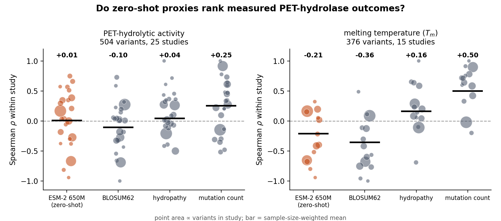
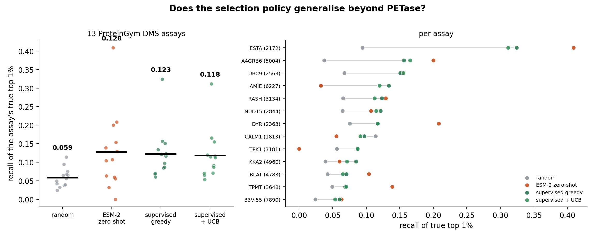

<!-- reconciliation note, added 2026-08-07 -->

> **Two concurrent tracks share this file, and their phase numbers collide.**
> Phases 27, 28, 29 and 30 each appear twice, written by two sessions working at
> the same time. One track is the *drafts* track (crossover figure, transfer
> test, page fitting, the two figure panels); the other is the *benchmark
> comparison* track (rubisco, SSMuLA, corpus offset, score skew). Read by section
> title, not by number. Nothing was overwritten; the numbering is simply not a
> single sequence.
>
> **The skew withdrawal does not touch either draft.** The benchmark track's
> Phase 30 withdraws the claim that score skew alone is a label-free
> pre-registration diagnostic. Neither submission ever made it: `skew`,
> `rubisco`, `SSMuLA`, `elite utility`, `bulk correlation`, `pre-registration`,
> `label-free` and `top-k` all occur zero times in both `main.tex` files. No
> correction is needed.
>
> One connection is live and already answered. That track's surviving finding,
> that bulk correlation does not predict elite utility, is the natural objection
> to the AI4Science draft's correlation-based Table 1: a reader could say a
> $\rho$ near zero says nothing about picking top variants. The draft does not
> rest on correlation alone. It reports a selection replay in which no scorer
> beats random, backed by the top-10% recall table in Phase 5 (random 0.261
> against 0.192, 0.258 and 0.133 for the three scoring protocols). The two tracks
> agree.
>
> **The PETML placement work (benchmark track, Phase 32) also needs no draft
> change, and it corroborates.** It measures what a campaign actually does on the
> corpus AI4Science is built from: selecting the top 20% by language-model score
> returns a utility of $-0.016$ (ESM-2) and $-0.006$ (ESM-C), against $+0.21$ to
> $+0.46$ for ProteinGym, SSMuLA and rubisco. That is the same failure AI4Science
> reports as $\rho \approx 0$, expressed in the decision-relevant metric, so it
> answers the natural objection that a correlation near zero says nothing about
> picking top variants. Verify-Agents already states the same thing in its
> appendix ($-0.077$ and $+0.006$ on that corpus). Neither draft needs a
> correction.
>
> Two cautions if it is ever cited. The spread is wide, from $-0.79$ to $+0.69$,
> and utility is positive in 6 of 10 units on ESM-2 and 5 of 10 on ESM-C, so the
> honest reading is *directionless*, not *reliably useless*, which matches the
> per-study panel in AI4Science. And PETML now has three different subsets in this
> project: 24 activity / 14 stability studies at $n \ge 5$ (AI4Science Table 1),
> 9 / 7 at $n \ge 15$ (Verify-Agents appendix), and 5 / 5 at $n \ge 25$ (the
> placement work). Any draft that cites the placement number must record its
> denominator alongside the others.

# Phase 1 findings: auditing ESM-2 zero-shot against measured PET-hydrolase outcomes

Run 2026-08-03. `python scripts/run_petase_audit.py`, ESM-2 650M wild-type
marginals, PETML corpus. Raw outputs in `results/`.



## Headline

**A protein language model's zero-shot score does not rank measured PET-hydrolytic
activity.** Across 504 variants in 25 published studies, the sample-size-weighted
within-study Spearman correlation is **ρ = +0.007**, positive in 13 of 24 studies
(sign test p = 0.84). That is indistinguishable from a coin flip.

This is the enzyme-side counterpart of the Adaptyv binder result. Every previously
published in-silico-versus-wet-lab failure was measured on binding affinity;
this is the same failure on catalysis.

| Proxy | Activity (504 variants, 25 studies) | Tm (376 variants, 15 studies) |
|---|---|---|
| ESM-2 650M zero-shot | **+0.007** (13/24 positive, p=0.84) | **−0.211** (6/14 positive, p=0.79) |
| BLOSUM62 | −0.105 | −0.356 |
| Kyte-Doolittle hydropathy | +0.042 | +0.163 |
| **mutation count** | **+0.251** | **+0.497** (12/14 positive, p=0.013) |

## The part that cuts against the simple reading

The obvious headline — "ESM-2 anti-predicts thermostability" — is itself an
artifact, and the audit catches it. Two facts explain the negative sign:

1. The masked-marginals score is a **sum of mostly-negative per-mutation
   terms**, so it falls mechanically as variants accumulate mutations. Measured:
   ESM-2 versus mutation count, ρ = −0.43 (activity) and −0.45 (Tm).
2. In published engineering campaigns, **more-mutated variants are better**,
   because a campaign is a selection process and the heavily-mutated entries are
   the ones that survived it.

Partialling out mutation count flips the sign and recovers a weak positive
signal: **+0.007 → +0.196** for activity, **−0.211 → +0.154** for Tm.

So the honest statement is not "the language model is anti-correlated with
stability." It is:

> ESM-2 zero-shot carries a weak positive signal (partial ρ ≈ 0.15–0.20) that is
> completely masked in the raw numbers by a mutation-count confound — and even
> after correction it is far below anything a design pipeline should be filtering
> on, and it loses outright to counting the mutations.

## The second finding, about the benchmark rather than the model

**Mutation count is the strongest single predictor in this corpus** (ρ = +0.50
against Tm, positive in 12 of 14 studies, p = 0.013). It is not biology. It is
campaign progression: aggregated literature variants encode the order in which
people published, and later entries carry more mutations *and* better numbers.

Any evaluation of a fitness proxy on aggregated literature variants that does not
control for mutation count is partly measuring publication history. That applies
to the emerging PETase benchmarks as much as to this run, and it is a concrete,
checkable recommendation the field does not currently follow.

## Methodology notes

- **Within-study, never pooled.** PET assay conditions — substrate crystallinity,
  solids loading, temperature, pH — vary enough between papers that pooled
  activity numbers are not comparable (Wei et al., *Nat Commun* 16:4684, 2025).
  Pooling would convert a between-assay offset into apparent signal.
- **Sign test, not just mean ρ.** A proxy that genuinely tracks a property should
  point the right way in most studies, not average above zero on the strength of
  one large one. Medians agree with the weighted means throughout, so no single
  study is carrying the result.
- 205 of 4,320 residue positions are ever mutated in this corpus, so only those
  are masked. Scores are identical to a full scan at 5% of the compute.
- Mutation numbering was recovered per scaffold by maximising agreement between
  reported wild-type letters and the sequence; all 14 scaffolds matched at 100%.

## Limitations

- **Selection bias.** These are variants somebody chose to publish. The corpus
  contains few designs that failed outright, which is exactly the regime a
  prospective filter has to handle.
- **Additivity.** Wild-type marginals cannot express epistasis, and much of this
  corpus is multi-mutant (up to 21 substitutions). Some of the shortfall is the
  scoring protocol rather than the model — worth testing against a masked-marginal
  or a supervised head before generalising.
- **One model.** ESM-2 650M only. ESM-1v, ESM-C, SaProt and the structure-aware
  predictors are untested here; ProteinGym reports inverse scaling above 650M, so
  a bigger model is not obviously a fix.
- Sign tests over 24 and 14 studies have modest power; treat p = 0.06 entries as
  suggestive.

## What this licenses us to say

Supported: a standard zero-shot pLM score does not usefully rank measured PET
hydrolase activity or Tm; a mutation count beats it; the raw correlations are
confounded by mutation count in a way nobody in this literature reports.

**Not** supported: that language models are useless for enzyme engineering (the
discovery/mining results, KbPETase and the NREL screen, are real), or that the
corrected +0.15–0.20 signal is zero. Do not overclaim either.

---

# Phase 1b: campaign backtest — does the selection policy matter more than the model?

`python scripts/run_backtest.py --budget 3 --rounds 3 --seeds 500`

Replays five published PET-hydrolase campaigns as budgeted decision problems: 3
variants per round, 3 rounds, 9 ordered in total. Value is the fraction of the
campaign's true best activity found; 1.0 means the policy found the winner.

| Policy | Mean | vs random | Campaigns beating random |
|---|---|---|---|
| random | 0.913 | — | — |
| **ESM-2 zero-shot ranking** | **0.770** | **−0.143** | **2 / 5** |
| supervised ridge, greedy | 0.985 | +0.072 | 5 / 5 |
| supervised ridge, UCB | 0.984 | +0.072 | 5 / 5 |

**Selecting variants by zero-shot language-model score is worse than picking at
random.** At a 6-variant budget it beats random in 0 of 5 campaigns (0.676 vs
0.873). The worst case is Cui 2021 PET film: zero-shot reaches 0.109 of the
campaign's best where random reaches 0.851.

Meanwhile a ridge regression on one-hot mutation indicators — a model with no
pretraining, no structure, and no biology — trained on the developer's own
prior rounds beats random in 5 of 5 campaigns after ordering just 9 variants.

The actionable form: **spend round 1 on diversity, not on model scores, then
switch to a supervised model fit on your own measurements.** Zero-shot ranking
is an active harm in the tight-budget regime, which is the regime that matters.

## Validity

This is offline counterfactual evaluation. It is sound only where the measured
set is dense enough that most actions the policy could take have a recorded
outcome; `density` (variants per distinct mutated site) is reported per campaign
and ranges 0.97–3.25 here. Published campaigns are also pre-selected — every
variant in the pool was worth someone publishing — which inflates absolute
numbers for *every* policy, so read the between-policy margins, not the levels.
Pools are small (23–85), so the metric saturates; the margin at small budgets is
where the signal lives.

---

# Phase 2: ProteinGym validation — the PETase claim does not generalise

`python scripts/run_proteingym_backtest.py --budget 48 --rounds 4 --seeds 100`

13 ProteinGym v0.1 DMS assays, enzyme-weighted, pools of 1,813–7,890 single
mutants. Budget 48/round x 4 rounds = 192 ordered (2–10% of each pool). Primary
metric is recall of the assay's true top 1%; best-found saturates on pools this
size. Replay is sound here because a near-complete single-mutant scan gives
almost every possible action a recorded outcome.



| Policy | Mean top-1% recall | vs random | Beats random in |
|---|---|---|---|
| random | 0.059 | — | — |
| ESM-2 zero-shot | **0.128** | **+0.069** | 10 / 13 |
| supervised ridge, greedy | 0.123 | +0.064 | **12 / 13** |
| supervised ridge, UCB | 0.118 | +0.059 | 12 / 13 |

## The correction

**Phase 1b claimed zero-shot ranking is "an active harm in the tight-budget
regime." That is wrong as a general statement.** On DMS assays zero-shot more
than doubles random recall and edges out the supervised policy on the mean. The
earlier result was real but regime-specific, and the regime is what matters.

## What actually distinguishes the regimes: mutation count

The masked-marginals score is a **sum** over mutated positions of
mostly-negative terms, so it falls mechanically as variants accumulate edits.
Phase 1 measured this directly: rho(ESM-2, mutation count) = −0.43 (activity),
−0.45 (Tm). In a pool where the best variants are also the most-mutated — which
is what an engineering campaign produces — that ranks the winners last. In a
single-mutant scan the confound cannot exist, because mutation count is constant.

The cleanest evidence is a within-lab contrast. Cui et al. 2021 published two
datasets on the same enzyme in the same year:

| Dataset | Multi-mutant fraction | random | zero-shot |
|---|---|---|---|
| Cui 2021 NanoPET | 0.00 | 0.904 | 0.915 |
| Cui 2021 PET film | 0.98 (up to 11 substitutions) | 0.851 | **0.109** |

## The fix, and its limit

Dividing the score by the number of mutations — averaging instead of summing,
no change to the model — recovers part of it. Zeng 2022 goes 0.889 → 1.000,
Pfaff 2022 goes 0.973 → 1.000, and beats-random rises from 2/5 to 4/5.

It does **not** rescue Cui PET film (0.109, unchanged). So mutation count is a
real and partly correctable confound, not the whole story, and per-mutation
normalisation should be offered as a diagnostic rather than sold as a solution.

## Where this leaves the product thesis

Stronger, but the argument has changed from accuracy to **reliability**:

- Zero-shot is the higher-variance policy: best single result of anything tested
  (ESTA_BACSU 0.409 versus random 0.095) and also the worst (TPK1 0.000 versus
  random 0.056; catastrophic on Cui PET film). Its spread across assays runs the
  full 0.000–0.409 range.
- Supervised-on-your-own-rounds is nearly as good on average, beats random in
  12/13 assays plus 5/5 campaigns, and was never catastrophic anywhere.
- **You cannot tell in advance which regime you are in.** That is the product:
  run both, detect the confound, and report which one has earned trust on *this*
  campaign — rather than shipping a default that is excellent on DMS and
  catastrophic on multi-mutant engineering.

## Limitations

- ProteinGym v0.1 (87 assays) via the HuggingFace mirror; the Harvard endpoint
  was unreachable. 13 assays chosen for enzyme content, pool size, and sequence
  length ≤ 500 — not a random sample of the benchmark.
- Single mutants only. The multi-mutant regime is represented solely by the five
  PETase campaigns, so the mechanism above rests on 5 campaigns plus a measured
  correlation, and one catastrophic case carries much of the effect.
- ESM-2 650M with masked marginals in wild-type context throughout. ESM-1v or a
  supervised stability head could behave differently.

---

# Phase 3: the mutation-count confound, tested directly

`python scripts/run_mechanism_test.py`

Phase 2 *inferred* the mechanism from five campaigns, with one catastrophic case
carrying much of the effect. This tests it under control.

**Construction.** Take a DMS assay's single mutants, whose fitness and
per-mutation ESM delta are both known. Compose synthetic k-mutants at distinct
positions. Ground truth is the sum of component fitnesses; the ESM score is the
sum of component deltas, exactly as masked marginals computes it. Two
conditions — components drawn from the top 30% by fitness (`beneficial`,
mimicking a campaign where more edits means better) or uniformly (`random`). 8
assays, 400 composites per k, k = 1…6.

**Assumption: additive ground truth.** Real multi-mutants have epistasis, so this
does not predict actual fitness. It isolates whether the summation in the scoring
protocol produces the observed anti-correlation. Epistasis adds noise; it does
not change the arithmetic.

## Mixed-k pools — the correlation collapses

Mean Spearman(ESM sum, truth) across assays, as the pool widens:

| max k | beneficial | random | rho(k, truth) | rho(k, ESM) |
|---|---|---|---|---|
| 1 | +0.077 | +0.546 | — | — |
| 2 | −0.212 | +0.321 | +0.657 | −0.367 |
| 4 | −0.447 | +0.101 | +0.798 | −0.573 |
| 6 | **−0.563** | **+0.004** | +0.844 | −0.672 |

Both conditions degrade monotonically. The two right-hand columns are the
mechanism itself: mutation count pushes fitness **up** and the ESM score
**down**.

## Fixed-k control — the model is not worse at multi-mutants

Spearman(ESM sum, truth) within a constant mutation count:

| k | 1 | 2 | 3 | 4 | 5 | 6 |
|---|---|---|---|---|---|---|
| random | 0.546 | 0.548 | 0.530 | 0.537 | 0.529 | 0.538 |
| beneficial | 0.077 | 0.041 | 0.056 | 0.039 | 0.074 | 0.059 |

**Flat.** The score ranks 6-mutants exactly as well as it ranks single mutants.
The failure in Phase 1b was never the model's competence at multi-mutants — it is
entirely an artefact of comparing variants that carry different numbers of edits.

(The low absolute level under `beneficial` is range restriction: drawing only
from the top 30% compresses the fitness spread.)

## Per-mutation normalisation

Dividing by k recovers much of the loss in the `random` condition
(+0.004 → +0.336 at k ≤ 6) and removes the anti-correlation under `beneficial`
(−0.563 → −0.024), but restores neither to the fixed-k level. It is a mitigation,
not a fix — which is why `gauntlet audit` reports the confound rather than
silently correcting it.

## The actionable rule

**Never rank a mixed-mutation-count pool by a summed zero-shot score.** Compare
within a fixed mutation count, or normalise per mutation and treat the result as
degraded. This is a property of the scoring protocol, not of any particular
model, so it applies to any additive per-position score.

---

# Phase 4: no scoring protocol rescues the multi-mutant regime

`python scripts/run_scorer_comparison.py`

**Correction first.** What Phases 1–3 called "wild-type marginals" is actually
**masked marginals in wild-type context** — the implementation masks each
position before reading probabilities, whereas Meier's wt-marginals uses a
single unmasked pass. No number changes; the label was wrong. Masking was
therefore never the missing ingredient, which leaves additivity.

Three scorers, peeling the additive structure away:

| scorer | per-term context | summed over mutations? |
|---|---|---|
| `masked_wt` | wild type — blind to the variant's other edits | yes |
| `mutant_marg` | the mutant — sees the other edits | yes |
| `seq_loglik` | whole sequence, mutant minus wild type | **no** |

Sanity check: on the all-single-mutant campaign `masked_wt` and `mutant_marg`
are identical (+0.159), as they must be — masking the sole mutated position
erases the mutation, so both contexts are the same sequence.

## Spearman vs measured activity, within campaign

| campaign | multi | max k | masked_wt | mutant_marg | seq_loglik |
|---|---|---|---|---|---|
| Cui 2021 NanoPET | 0.00 | 1 | +0.159 | +0.159 | +0.202 |
| Cui 2021 PET film | 0.99 | 11 | −0.696 | −0.658 | −0.473 |
| Nakamura 2021 | 0.30 | 7 | +0.353 | +0.292 | −0.023 |
| Pfaff 2022 | 0.10 | 4 | +0.350 | +0.367 | +0.169 |
| Zeng 2022 | 1.00 | 7 | −0.001 | −0.143 | +0.199 |
| **multi-mutant mean** | | | **−0.348** | **−0.400** | **−0.137** |
| **mostly-single mean** | | | **+0.288** | **+0.273** | **+0.116** |

## Three conclusions

1. **Context-awareness is not the problem.** `mutant_marg` gives every term
   sight of the variant's other substitutions and changes nothing — it is
   slightly *worse* on multi-mutant campaigns (−0.400 vs −0.348). Epistasis
   within the scoring context is not what breaks these scores.
2. **Dropping the summation helps, and confirms the mechanism again.**
   `seq_loglik` roughly halves the anti-correlation (−0.348 → −0.137) and
   weakens the mutation-count confound everywhere it was strongest (Cui PET film
   −0.798 → −0.570), exactly as predicted for a score that is not a sum of
   per-mutation terms.
3. **But it is not a fix.** `seq_loglik` never becomes useful on multi-mutant
   campaigns, and it *destroys* the signal where the additive score worked
   (+0.288 → +0.116). And in selection replay **no scorer beats random**:

| | random | masked_wt | mutant_marg | seq_loglik |
|---|---|---|---|---|
| mean top-10% recall | **0.261** | 0.192 | 0.258 | 0.133 |

## What this settles

You cannot score your way out of this. The confound is real and its mechanism is
now confirmed three separate ways, but every protocol change that weakens it
also weakens the signal, and none produces a ranking worth ordering from.

The fix is therefore not a better score — it is a better **comparison**: hold
mutation count fixed, or fit on your own measurements. That is a decision-layer
fix, which is what `gauntlet audit` and `gauntlet plan` implement.

## Limitation

`seq_loglik` is a single unmasked forward pass, not a true pseudo-log-likelihood
(which needs one masked pass per residue — roughly 19,000 passes for one
campaign). It shares the property under test, being a whole-sequence quantity
rather than a sum of per-mutation terms, but it is a weaker estimator. A null
from it is weaker evidence than a positive would have been, and true PPPL
remains the one untested protocol option.

---

# Phase 5: held-out validation on the NREL condition-resolved release

`python scripts/prepare_nrel.py && gauntlet backtest --campaign data/nrel/nrel_campaign.csv --esm --budget 8 --rounds 3 --split-conditions`

The first test on data that did **not** shape the tool's design. Source: Zenodo
10.5281/zenodo.15417757 (CC BY 4.0), behind Norton-Baker, Komp, Gado et al.,
*ACS Catalysis* (2025). 213 proteins x 11 assay conditions (pH 4.5–8.5, 40/60 °C,
crystalline powder / amorphous film) = 1,570 measurements, 28.9% nonzero.

## What the dataset forced

It is a **mining** campaign — 213 distinct natural proteins, 193–517 residues,
~4% identity between the first two — not variants of a scaffold. Gauntlet's
variant format did not fit, which is a scope limit a held-out dataset was
supposed to expose and did. Rather than coerce homologs into mutation notation
(where mutation count would silently become phylogenetic distance), the tool
gained a sequence mode: composition + length features, sequence length as the
nuisance variable in place of mutation count, no corrected view (there is no
mutation count to hold fixed), and whole-sequence mean log-likelihood as the
ESM score since there is no scaffold to mask against.

## Cross-condition result: recall of the true top 10%

| policy | range across 11 conditions | beats random |
|---|---|---|
| random | 0.116 – 0.441 | — |
| **supervised_greedy** | 0.157 – 0.471 | **11 / 11** |
| **supervised_ucb** | 0.152 – 0.501 | **11 / 11** |
| rank_by_mean_hydropathy | 0.250 – 0.800 | 10 / 11 |
| rank_by_esm2_seq_loglik | 0.048 – 0.400 | 3 / 11 |
| rank_by_seq_len | 0.000 – 0.400 | 2 / 11 |

**The central claim held.** A ridge model on the developer's own measurements
beat random in every one of 11 independent assay conditions — on a dataset that
did not shape the design, in a regime the tool was not built for, with a
different featuriser. That is as close to an out-of-sample test as this project
has had.

**The language model failed again.** Whole-sequence ESM-2 log-likelihood beat
random in 3 of 11 conditions and was worse than random in most. Third regime,
third failure, now including one where the score is length-normalised by
construction.

## The finding that cuts against the supervised policy

**Mean Kyte-Doolittle hydropathy — one scalar, no learning — beats the
supervised model in magnitude in 10 of 11 conditions**, often by a wide margin
(0.625 vs 0.223; 0.800 vs 0.471). It misses only one condition, so it loses on
consistency but wins on strength.

This may well be mechanistic rather than artefactual: PET is a hydrophobic
crystalline substrate, so surface hydrophobicity plausibly tracks binding. Either
way it is the trivial-baseline result again, in a new regime, and it says a
mining campaign should be ranking on hydropathy before it reaches for a
language model.

## A real gap this exposed in `plan`

On the same data `plan` returns SUPERVISED (out-of-fold Spearman +0.319) and
reports `mean_hydropathy` at only **+0.066**. Both numbers are right, and they
disagree because they measure different things: `plan` selects proxies by
**overall rank correlation**, while what a batch actually needs is **top-decile
enrichment**. A proxy can be near-useless on average rank and still be the best
thing available for finding the top 10% — which is exactly what hydropathy is
here.

`diagnose` should score proxies by top-decile enrichment, not Spearman. Until it
does, `plan` can pass over the proxy that would have filled the batch best.

## Limitations

- Offline replay on a pre-selected pool: these 213 proteins were themselves
  chosen by an ML pipeline, so absolute recall is optimistic for every policy.
  Read the between-policy margins.
- Random's recall varies 0.116–0.441 across conditions because pool sizes vary
  (54–213); ordering 24 of 54 finds a good fraction of the top decile by luck.
- The sequence-mode featuriser (composition + length) is a stand-in chosen for
  honesty, not performance. A stronger one would likely raise the supervised
  numbers, and was deliberately not tuned.

---

# Phase 6: selecting proxies by top-decile enrichment

Phase 5 exposed a defect with a concrete repro: on the NREL release `plan`
returned SUPERVISED while reporting `mean_hydropathy` at Spearman **+0.066** —
yet in the replay that same scalar beat random in 10 of 11 conditions and beat
the supervised model in magnitude in most of them. `plan` was selecting proxies
by overall rank correlation, and a batch does not need the whole ordering to be
right. It needs the good ones near the top.

`diagnose` now scores every candidate scorer, and the cross-validated model, by
**fold-enrichment of the true top decile**: of the top k a scorer picks, how many
are in the true top k, over what a random pick of k would get. 1.0x is random.

On the same NREL condition:

```
  scorer                enrichment   spearman
  supervised (CV)            2.50x     +0.319
  mean_hydropathy            2.50x     +0.066
  seq_len                    0.00x     +0.054  (not selectable)
```

The divergence is stark: hydropathy is a near-useless ranker (+0.07) and a
top-decile finder as good as a model fit on 160 measurements. Under the old rule
it could never have been chosen. The verdict stays SUPERVISED — ties go to the
model on your own data, which was the never-catastrophic policy across 13 DMS
assays, 5 campaigns and 11 conditions — but the tied proxy is now surfaced as
worth ordering alongside, because it reaches the same enrichment by a different
route.

The variant path is unchanged in outcome and better instrumented:

```
  supervised (CV)            3.76x     +0.911
  esm2_wtm                   0.00x     -0.728
  n_mut                      1.88x     +0.942  (not selectable)
```

ESM-2 at **0.00x** is a cleaner statement of the Phase 1 result than −0.728 was:
on this campaign the zero-shot score puts *none* of the true top decile in its
own top decile.

## Caveat: enrichment is quantised

With k elites the metric moves in steps of n/k², so on a 47-variant campaign
(k=5) the resolution is 1.88x and on a 160-variant one (k=16) it is 0.62x. Two
scorers reported as tied may not be truly tied. `plan` prints the step size so
the resolution is never hidden, and ties are broken toward the model fit on the
developer's own data rather than silently.

---

# Phase 7: backtesting the decision rule itself

`scripts/run_backtest.py` and `scripts/run_proteingym_backtest.py`, both with a
new `planner` policy.

**A correction to the premise.** These two backtests never had a Spearman-based
proxy-selection step — they compare *fixed* policies, each ranking by a given
prior. Re-running them after the Phase 6 change would have produced byte-identical
numbers. The enrichment change lives in `diagnose`/`recommend`, which only `plan`
calls.

So the answerable version of the question is: **does the decision rule make good
calls?** `PlannerPolicy` applies it every round, judging only on measurements
taken so far — re-fitting, re-scoring the whole proxy menu, and choosing between
exploit-supervised, exploit-proxy, and explore. Nothing in it sees unmeasured
fitness. It is the policy `gauntlet plan` actually implements, and it had never
been tested.

## ProteinGym: the rule works, narrowly

Budget 48 x 4 rounds = 192 ordered, 13 assays, 60 seeds. Recall of the true top 1%:

| policy | mean | vs random | beats random |
|---|---|---|---|
| random | 0.058 | — | 0/13 |
| zero_shot_esm2 | 0.128 | +0.070 | 11/13 |
| supervised_greedy | 0.126 | +0.068 | 12/13 |
| supervised_ucb | 0.121 | +0.063 | 12/13 |
| **planner** | **0.132** | **+0.074** | **12/13** |

The planner has the best mean *and* ties for the best consistency. It is not
merely picking the better of its two options: on `A4GRB6` (0.262 vs 0.200 /
0.146), `AMIE` (0.159 vs 0.032 / 0.145) and `ESTA_BACSU` (0.452 vs 0.409 /
0.343 — the best number any policy has produced on the PET-hydrolase analogue)
it exceeds both, by switching across rounds.

Read the margin honestly: **+0.006 over supervised and +0.004 over zero-shot**,
against a per-assay spread of 0.05–0.45. On the secondary best-found metric it is
*worst* of the non-random policies (0.834, 9/13), which is what tuning for
top-decile enrichment costs.

## Two mis-calibrations this exposed

**1. The trust threshold can exceed the budget.** On the PETase campaigns at
budget 3 x 3, the planner scored *exactly* random (0.915, **0/5** campaigns). Nine
total measurements never reach `MIN_FOR_TRUST = 12`, so it explores every round
by construction. A rule that silently degrades to random on a small campaign is
worse than no rule, because a verdict is still printed as though a judgment
occurred. At budget 8 x 5 it does exploit and edges everything (0.997 vs
supervised 0.995, random 0.992) — but there the 23–85-variant pools saturate, so
that comparison decides nothing.

**2. It under-exploits, repeatedly.** `DYR` 0.078 where zero-shot reached 0.208;
`KKA2` 0.048 where supervised reached 0.084; also `NUD15`, `RASH`, `TPK1`. It is
above random in 12/13, but it leaves substantial value unclaimed in roughly a
third of assays.

Leading hypothesis, untested: after round one there are 48 observations, so the
elite set is k=5 and enrichment is quantised in steps of ~9.6x. The rule makes a
hard go/no-go call against a 1.5x threshold using an estimate that cannot resolve
it. If that is right, the fix is not a different threshold but not making a hard
exploit/explore call on 48 points at all. Logging per-round decisions against the
true best choice would settle it.

## Where this leaves the tool

Every component is validated except the decision rule that ties them together,
and that rule is the product. On large pools it is the best policy tested. On
small campaigns it is indistinguishable from random and does not say so.

---

# Phase 8: tracing the planner's decisions against an oracle

`python scripts/run_planner_trace.py --seeds 40`

Phase 7 left a hypothesis: the planner under-exploits because the enrichment
estimate is too quantised at small n to resolve the 1.5x threshold. This tests
it. Six ProteinGym assays (three the planner won on, three it under-exploited),
40 seeds, 4 rounds — 960 decisions. At each round the planner's choice and its
estimates are recorded, then every available action is evaluated on the
held-out fitnesses it cannot see. Regret is elites missed against the best
action available at that moment.

## The hypothesis was partly right, and was not the main story

| | count | mean regret |
|---|---|---|
| **THRESHOLD** — explored, exploiting was better | 234 | **2.23** |
| **MIS-RANKING** — exploited the wrong option | 272 | 1.36 |

Both failure modes are real. Threshold misses are **less frequent but ~64% more
costly** per occurrence. Mis-ranking is the more common one — the estimates order
the options wrongly even when something clears the bar. So softening the
threshold alone would fix under half the lost value.

Overall the planner picks the best available action **47.3%** of the time against
a 3-way choice (chance is ~33%), at a mean cost of **0.93 elites per round**.

## Small-n unreliability is confirmed

| round | n_seen | picked best | explored | regret |
|---|---|---|---|---|
| 0 | 0 | 0.475 | 1.000 | 1.262 |
| 1 | 48 | **0.371** | 0.133 | 0.979 |
| 2 | 96 | 0.517 | 0.329 | 0.817 |
| 3 | 144 | 0.529 | 0.229 | 0.658 |

Accuracy is worst exactly where predicted — round 1, the first round where a
judgment is possible, on 48 observations — and improves as measurements
accumulate. Round 0 is forced exploration, so its 0.475 is luck, not judgment.

**Correcting a number from Phase 7:** I said the estimate is quantised in steps
of ~9.6x at n=48. That is the *maximum*, not the step. With k=5 and expected
k²/n = 0.52, the step is **1.92x** and the ladder is {0, 1.92, 3.84, …}. The 1.5x
bar therefore reduces to "did at least 1 of my top 5 land in the observed top 5" —
a near coin-flip at low signal. **26.4%** of supervised estimates and **24.0%** of
ESM estimates come out at exactly 0.00, forcing exploration.

## What this means for the fix

Not a different threshold. The enrichment estimate computed on the observed set
is a poor guide at these sample sizes for *both* jobs it is being asked to do —
go/no-go and ranking between options. Candidate directions, none yet tested:
score options by out-of-fold rank-based statistics that do not collapse to a
handful of integers; blend proportionally to estimated confidence rather than
switching; or pool information across rounds instead of re-estimating from
scratch each time.

## Limitation

The oracle's explore arm is a single random draw, so its realised yield is noisy
and it sometimes wins by luck — explore was scored "best" in 32% of rounds. That
inflates the apparent miss count somewhat. Using explore's expected value rather
than one draw would tighten the comparison, and the THRESHOLD/MIS-RANKING split
is the robust part of this result.

---

# Phase 9: choosing the decision statistic, and why six assays are not enough

`scripts/run_rule_comparison.py` (tuning set and `--assays` held-out set)

Phase 8 left two candidate fixes and a hypothesis. This tests them.

## Fixing the oracle first

Phase 8 scored the explore arm with a single random draw, so it sometimes won by
luck and inflated the miss count. Scoring it by expected yield instead
(`budget x elites_in_pool / pool`) makes every action deterministic and regret
comparable. That alone moves "picks the best action" from **47.3% to ~59%** — the
Phase 8 headline was pessimistic, and part of the diagnosis rested on a noisy
oracle.

## Six rules, 13 assays, paired at identical decision points

Mean regret (elites missed per round), rank in parentheses:

| rule | tuning (6 assays) | held-out (7) | pooled (13) |
|---|---|---|---|
| **auroc@0.55** | 0.693 (3) | **0.441 (1)** | **0.557 (1)** |
| enrich@1.0 | **0.632 (1)** | 0.528 (5) | 0.576 (2) |
| auroc@0.60 | 0.730 (4) | 0.464 (2) | 0.587 (3) |
| enrich@1.5 *(incumbent)* | 0.670 (2) | 0.558 (6) | 0.610 (4) |
| spearman@0.20 | 0.857 (6) | 0.468 (3) | 0.647 (5) |
| auroc@0.65 | 0.817 (5) | 0.504 (4) | 0.649 (6) |

**The ranking does not replicate between assay sets.** The incumbent went from
2nd to last; `enrich@1.0`, which won the tuning set, fell to 5th. Had this
stopped at six assays it would have adopted the wrong statistic. Rule selection
needs more assays than intuition suggests.

Paired Wilcoxon against the incumbent, on identical decision states:

- held-out: `auroc@0.55` **−0.117, p<1e-4** (differs on 334/1120 decisions)
- pooled: `auroc@0.55` **−0.053, p<1e-4**; `enrich@1.0` −0.034, p=1e-4;
  `spearman@0.20` **+0.038, p=3e-4 — significantly worse**, confirming Phase 6.

## The structural finding: one frontier, not better discrimination

Every rule sits on the same trade-off, total misses ~0.42 regardless:

| rule | threshold misses | mis-ranking misses |
|---|---|---|
| spearman@0.20 | 0.016 | 0.428 |
| auroc@0.55 | 0.020 | 0.377 |
| auroc@0.60 | 0.061 | 0.349 |
| auroc@0.65 | 0.139 | 0.299 |
| enrich@1.0 | 0.126 | 0.276 |
| enrich@1.5 | 0.157 | 0.255 |

None of them discriminates better; they slide along one frontier, trading one
error for the other. `auroc@0.55` wins because the errors it avoids — exploring
when exploiting would have paid — are the expensive ones (Phase 8: regret 2.23
vs 1.36).

## Adopted

AUROC at 0.55 is now the gate in `diagnose`, `recommend` and `PlannerPolicy`.
Enrichment and Spearman are still reported, because "2.5x better than random" is
what a developer can act on — enrichment is simply too quantised to decide on.

It immediately resolves a tie enrichment could not see. On NREL:

```
  scorer                  AUROC  enrichment   spearman
  supervised (CV)         0.707       2.50x     +0.319
  mean_hydropathy         0.645       2.50x     +0.066
```

Both read an identical 2.50x; AUROC separates them.

---

# Phase 10: does better decision-making translate? Partly.

`gauntlet backtest` on 13 ProteinGym assays, budget 48 x 4, 60 seeds, rerun with
the AUROC gate. The other four policies do not use the gate and came out
byte-identical to Phase 7 — a useful check that only the planner changed.

## The gate improvement is real

| planner | mean top-1% recall | vs random | beats random |
|---|---|---|---|
| enrichment gate (Phase 7) | 0.132 | +0.074 | 12/13 |
| **AUROC gate** | **0.146** | **+0.088** | 11/13 |

Improved on **10 of 13** assays, worse on 3, mean **+0.014**, Wilcoxon
**p = 0.033**. Biggest gains where it previously under-exploited:
`ESTA_BACSU` 0.452 → 0.531, `AMIE` 0.159 → 0.199, `TPMT` 0.087 → 0.100. The
12/13 → 11/13 drop is `TPK1` slipping from 0.057 to 0.045 against random 0.056 —
a marginal flip, not a regression.

So a ~9% cut in decision regret (Phase 9) did carry through to the end metric.

## But the planner is still not demonstrably better than a fixed policy

Paired across the 13 assays:

| comparison | mean diff | p | planner better in |
|---|---|---|---|
| vs random | **+0.088** | **0.002** | 11/13 |
| vs supervised_ucb | +0.025 | 0.286 | 6/13 |
| vs supervised_greedy | +0.020 | 0.839 | 6/13 |
| vs zero_shot_esm2 | +0.019 | 0.455 | 6/13 |

The planner has the best **mean** of any policy (0.146 against 0.128 and 0.126),
but that lead comes from large wins on a few assays — `ESTA_BACSU` 0.531 against
0.409, `A4GRB6` 0.249 against 0.200 — while losing on others. Against each fixed
policy it wins **6 of 13**, a coin flip.

**Beating random is established (p=0.002). Beating "just always use the
supervised model" is not.** That is the product thesis, and 13 assays cannot
detect a +0.02 difference against a per-assay spread of 0.05–0.53. Unproven is
not disproven — but it is unproven, and the tool should not claim otherwise.

## What would settle it

More assays, or a sharper question. ProteinGym v1.x has 217 substitution assays
against the 13 used here; running the full set is the direct route to the power
needed. The alternative is to stop asking whether adaptation beats a fixed
default on average and ask where it beats one — the planner's wins are
concentrated on assays where the two fixed policies disagree most, which is a
testable and more useful claim.

---

# Phase 11: the disagreement hypothesis, and what it uncovered instead

`python scripts/run_disagreement_analysis.py` — 1,560 decisions, 13 assays, 40 seeds.

Phase 10 left the product thesis unproven: the planner has the best mean recall
but beats each fixed policy in only 6/13 assays. Rather than chase significance
on a global average, this tests a sharper claim — that adapting pays *where the
scorers disagree* — using a disagreement statistic computable at plan time from
the developer's own data, so it could actually gate the decision.

## The hypothesis does not survive a second metric

Under **Jaccard disagreement** (1 − overlap of the two top-48 picks) the effect is
clean and monotone:

| quartile | disagreement | planner | always-supervised | advantage | p |
|---|---|---|---|---|---|
| Q1 agree | 0.954 | 1.547 | 2.043 | **−0.495** | <1e-4 |
| Q2 | 0.979 | 1.830 | 2.260 | −0.429 | 0.0003 |
| Q3 | 0.989 | 1.600 | 1.763 | −0.163 | 0.246 |
| Q4 disagree | 1.000 | 1.388 | 1.150 | **+0.237** | 0.0024 |

But it **does not replicate** under rank disagreement (1 − Spearman over the
pool): rho = +0.020, p = 0.42, and the planner is worse in *every* quartile. And
Jaccard cannot gate anything regardless — with 48 picks from thousands of
candidates the two rankings essentially never overlap, so it is saturated
(median 0.979, IQR 0.968–0.989). Every threshold either adapts always or never.

**No usable gate exists.** The best gating threshold is one that adapts ~5% of
the time, i.e. "almost never adapt" (−0.003 against always-supervised).

## What the analysis found instead: the adaptation itself is wrong

Splitting by what the planner chose:

| chosen | share | planner | always-supervised | advantage | p |
|---|---|---|---|---|---|
| supervised | 43.5% | 2.278 | 2.278 | 0.000 | — |
| **zero_shot** | **46.4%** | 1.141 | 1.576 | **−0.435** | <1e-4 |
| explore | 10.1% | 0.522 | 0.752 | −0.229 | 0.083 |

The planner switches to zero-shot on nearly half of all decisions and is right
only **29%** of those times. The question was never *when* to adapt; it is that
the adaptation is usually a mistake.

## Root cause: the comparison is not fair

The supervised model is scored **out-of-fold** — trained on 4/5 of the data — while
the proxy is scored **in-sample**, which costs it nothing because it has no
parameters to overfit. Mean AUROC 0.607 supervised vs 0.632 zero-shot; the proxy
wins the comparison on 54% of decisions. Then the model that actually gets
deployed is trained on *all* n, so it is better than the estimate it was rejected on.

Requiring the proxy to beat the model by a margin M helps monotonically but never
reaches parity (approximate — states were visited under M=0.01, so this reweights
rather than replays):

| margin | % supervised | % zero-shot | vs always-supervised |
|---|---|---|---|
| 0.01 *(current)* | 44% | 46% | −0.229 |
| 0.10 | 55% | 35% | −0.147 |
| 0.20 | 63% | 27% | **−0.078** |
| 1.00 *(never switch on merit)* | 66% | 24% | −0.079 |

Even at an infinite margin it is 0.079 short, because in 24% of decisions the
supervised out-of-fold AUROC falls below the 0.55 bar and the planner refuses a
model that would have done fine. **The gate and the tie-break are miscalibrated
in the same direction, and for the same reason.**

## Reconciling with Phase 10

Phase 10 measured cumulative recall over a whole campaign and the planner won
(0.146 vs 0.126). This measures per-round elite capture and it loses. Both are
correct: this criterion is **myopic**, charging exploration in full and never
crediting what it buys downstream.

Taken together they say something the product thesis did not anticipate: the
planner's cumulative edge is unlikely to come from choosing correctly between
scorers — it chooses wrong most of the time it deviates — and more likely from
**exploration diversifying the training set** for later rounds. That is a real
effect worth having, but it is not the "know which model to trust" story, and
the tool should not be sold on that story until the mechanism is confirmed.

---

# Phase 12: fixing the unfair comparison — real, but only a fifth of the problem

Phase 11 diagnosed an asymmetry: the supervised model was scored by 5-fold CV
(each fold model trained on 4/5 of the data) against a parameter-free proxy whose
held-out and in-sample predictions are identical, so it carries no handicap. The
model that then gets deployed is trained on all n, better than the estimate it was
rejected on.

**The fix.** Leave-one-out instead of k-fold, so the evaluated model matches the
deployment training size. Ridge has a closed form via the hat matrix,
`yhat_i^(-i) = y_i - e_i / (1 - h_ii)`, costing one solve rather than n refits.
Implemented with an unpenalised intercept column — centring on the full sample is
wrong, because leaving a point out also moves the mean. Verified against
brute-force LOO to **1e-11** for both n>p and n<p.

## Effect

| | 5-fold CV | leave-one-out |
|---|---|---|
| mean supervised AUROC | 0.607 | **0.614** |
| mean proxy AUROC | 0.632 | 0.631 |
| proxy scores higher on | 54% | **52%** |
| proxy chosen | 46.4% | **45.5%** |
| advantage when proxy chosen | −0.435 | **−0.366** |
| **overall vs always-supervised** | **−0.225** | **−0.184** |

The diagnosis was correct and the fix helps — an **18%** reduction in the
deficit. But the handicap was worth only **0.007 AUROC**, and the planner is
still clearly worse than simply always using the supervised model.

## What this means

The unfair comparison was real but is not why the decision rule fails. Even
scored fairly, an AUROC estimated on 48–192 observed points does not predict
which scorer will do better on the unmeasured pool. The proxy still wins 52% of
comparisons and acting on it still costs 0.366 elites per round.

Three attempts have now been made to repair the switching logic — a better
statistic (Phase 9), a gating condition (Phase 11), a fair protocol (Phase 12) —
and each was individually justified, each helped a little, and none brought it to
parity with a fixed policy. The remaining hypothesis is that the switching logic
is unnecessary and the planner's cumulative advantage (Phase 10) comes from
exploration diversifying the training set instead.

**That is now the decisive experiment**: always-supervised plus a fixed
exploration fraction, no scorer switching. If it matches the planner, the
adaptive layer should be deleted rather than repaired.

---

# Phase 13: the condition-pooling claim is wrong on real data

`scripts/run_nrel_conditions.py`, `scripts/run_nrel_condition_control.py`

The tool refuses to pool measurements across assay conditions, justified by a
demonstration that pooling costs a supervised model +0.231 vs +0.808 out-of-fold
Spearman. **That demonstration used synthetic strata** — one campaign split in
half with a +2.5 offset injected. The NREL release has 11 genuine conditions, so
the claim can be tested for real.

## It does not hold

Fitting per condition and evaluating within it, against a model pooled across all
11 and evaluated on the same rows:

| | mean AUROC |
|---|---|
| within condition | 0.645 |
| **pooled across all 11** | **0.716** |

Pooling is *better*, in 8 of 11 conditions. But that confounds purity with size —
the pooled model sees up to 9x more rows. The size-matched control settles it:
train on the same number of rows drawn **entirely from other conditions**, so only
the mixing differs.

| | mean AUROC | vs within |
|---|---|---|
| within condition (n rows, same condition) | 0.645 | — |
| **mixed at equal n (n rows, other conditions)** | **0.653** | −0.008, p=0.83 |
| pooled-full (1,570 rows) | 0.716 | −0.071, p=0.067 |

**Condition purity is worth nothing here.** A training row from a different pH,
temperature and substrate is as useful as one from the same condition, and
pooling wins purely by brute force.

## What this changes

The tool's refusal to pool is not supported by the only real multi-condition
dataset available, and the README's flagship readiness number is synthetic. Both
are corrected. What survives is narrower and still true:

- Activity **values** are not comparable across conditions — a 70 °C number is
  not a 40 °C number, and Wei et al. are right that cross-paper rates cannot be
  compared directly.
- But for **ranking which protein is better**, these 11 conditions agree enough
  that mixing them costs nothing measurable.
- Those are different questions, and this work conflated them.

The honest readiness claim is therefore not "pooling is harmful" but **"conditions
are almost never recorded, so nobody can check whether pooling is safe."** With
NREL's conditions recorded we could check, and the answer was that it is safe.
With PETML's conditions in figure captions, the question cannot be asked at all.
That reframing is stronger, because it is what the evidence supports.

## Limitations

One dataset, one featuriser (composition + length), one task (ranking within a
condition). A different feature set, or modelling absolute activity rather than
rank, could easily reverse this. The correct posture is to measure it per
campaign, not to assume either way — which is what the tool should do and
currently does not.

---

# Phase 14: exploration is not the mechanism

`gauntlet backtest` with `EpsilonSupervisedPolicy` — always fit a model, spend a
fixed slice of each batch at random, never switch scorer.

Phase 11 suggested the planner's cumulative edge came from exploration
diversifying the training set rather than from choosing correctly between
scorers, since it chooses wrong 71% of the times it deviates. This tests that
directly.

| policy | mean top-1% recall | vs supervised_greedy | p | better in |
|---|---|---|---|---|
| supervised_greedy (eps=0) | 0.126 | — | — | — |
| sup_eps10 | 0.125 | −0.0014 | 0.497 | 6/13 |
| sup_eps25 | 0.123 | −0.0037 | 0.239 | 5/13 |
| sup_eps50 | 0.107 | **−0.0198** | **0.0005** | 1/13 |
| **planner** | **0.145** | +0.0188 | 0.735 | 7/13 |

**The hypothesis is refuted.** Random exploration does not reproduce the
planner's advantage — it does nothing at 10–25% and is significantly *harmful* at
50%. Whatever the planner gains, it is not from exploring.

That resolves the Phase 10 / Phase 11 contradiction in favour of Phase 10: the
myopic per-round criterion charged exploration in full and judged each switch in
isolation, and concluded switching was harmful when cumulatively it is not.

## But the planner still cannot be shown better than a fixed policy

| planner vs | diff | p | better in |
|---|---|---|---|
| sup_eps10 | +0.0202 | 0.542 | 7/13 |
| sup_eps25 | +0.0225 | 0.497 | 7/13 |
| sup_eps50 | +0.0386 | **0.048** | 10/13 |

It has the best mean of anything tested (0.145 against 0.126 and 0.128) and
cannot be distinguished from any sensible fixed policy at n=13. Three separate
framings have now hit the same wall: the effect is roughly +0.02 and the
per-assay spread is 0.05–0.53.

**This is a power problem, not a modelling problem.** The assay set has been
widened from 13 to 41 (all ProteinGym v0.1 assays with length ≤ 500 and ≥ 1,200
single mutants, now scored and cached) specifically to resolve it.

---

# Phase 15: 41 assays, and a second scorer family

## Widening to 41 assays did not resolve the planner question — informatively

All ProteinGym v0.1 assays with length ≤ 500 and ≥ 1,200 single mutants; 13 → 41.

| policy | mean top-1% recall | beats random |
|---|---|---|
| random | 0.067 | — |
| zero_shot_esm2 | 0.144 | 25/41 |
| supervised_greedy | 0.142 | **38/41** |
| sup_eps10 | 0.142 | 38/41 |
| **planner** | **0.168** | 35/41 |

| planner vs | diff | p | better in |
|---|---|---|---|
| random | +0.101 | <1e-4 | 35/41 |
| zero_shot_esm2 | +0.024 | **0.050** | 24/41 |
| supervised_ucb | +0.031 | 0.211 | 20/41 |
| sup_eps10 | +0.026 | 0.426 | 19/41 |
| supervised_greedy | +0.027 | 0.519 | **19/41** |

Tripling the sample did **not** produce significance against the supervised
policy, and the reason is the useful part: the planner beats `supervised_greedy`
in **19 of 41 assays — under half — while having a mean 0.027 higher**. Its
advantage is not a consistent shift but a heavy tail, a few large wins
(`ESTA_BACSU` 0.517 vs 0.343) against slight losses on the majority.

So the earlier framing was wrong. This was never a power problem to be solved by
more assays; the effect genuinely is not a location shift. The honest statement
for a developer:

- **`supervised_greedy` is the reliable choice** — beats random in 38/41.
- **`zero_shot` is the unreliable one** — 25/41, despite an almost identical mean.
- **The planner has the highest expected value and wins under half its
  head-to-heads.** Take it if you can absorb variance across many campaigns; take
  the supervised model if this campaign has to work.

## ESM-C reproduces ESM-2 almost exactly

Every zero-shot result to date used ESM-2 650M. ESM-C 300M is a different
architecture, lab and training run (EvolutionaryScale), scored with identical
masked marginals on the same 41 assays.

| | mean Spearman vs measured fitness |
|---|---|
| ESM-2 650M | +0.449 |
| ESM-C 300M | +0.448 |

Paired difference **−0.001, p = 0.67**, ESM-C better in 21/41 — indistinguishable.
The two scorers agree with each other at mean rho **+0.834**, above 0.7 on 35/41
assays.

**This closes the most obvious objection to every proxy claim in this work:** the
findings are about the class of zero-shot pLM scorer, not one checkpoint.

The exceptions are informative and match the literature on shallow-MSA taxa —
the lowest agreement is on viral proteins (`REV_HV1H2` 0.39, `TAT_HV1BR` 0.41,
`R1AB_SARS2` 0.61), and on `TAT_HV1BR` the two disagree wildly on quality
(ESM-2 +0.017 vs ESM-C +0.451). Where these models are known to be unreliable,
they are also unreliable *relative to each other*.

---

# Phase 16: the flagship claim under a second scorer family

`python scripts/run_petase_audit.py --scorer esmc --tag _esmc`

Level 1's headline — a zero-shot pLM does not rank measured PET-hydrolase
outcomes — rested entirely on ESM-2 650M. Rerun with ESM-C 300M, a different
architecture and lab, identical masked-marginals protocol, same 504 activity and
376 Tm measurements.

| | ESM-2 650M | ESM-C 300M |
|---|---|---|
| activity, raw | **+0.007** | **+0.082** |
| activity, best trivial baseline (n_mut) | +0.251 | +0.251 |
| activity, margin vs baseline | −0.244 | −0.169 |
| activity, after removing n_mut | **+0.196** | **+0.173** |
| Tm, raw | −0.211 | −0.023 |
| Tm, after removing n_mut | **+0.154** | **+0.158** |
| correlation with n_mut (activity / Tm) | −0.429 / −0.452 | −0.247 / −0.233 |

The two scorers agree with each other at rho **+0.839** across 608 PETase variants.

## What generalises, and what does not

**Generalises — the claim the papers rest on.** Neither model ranks measured
PET-hydrolase outcomes usefully, and **both lose to a bare mutation count** by a
wide margin (−0.169 and −0.244 on activity; −0.475 and −0.286 on Tm). The
enzyme-side proxy failure is a property of the class.

**Does not generalise — the exact headline number.** ESM-2's ρ = +0.007 is
partly an ESM-2 fact. ESM-C reads +0.082 on the same data. Quoting "+0.007" as
*the* result would overstate how model-independent it is, and the papers should
quote both.

## The most interesting result: the corrected numbers agree

The raw numbers differ (+0.007 vs +0.082; −0.211 vs −0.023) **because the two
models carry different confound strengths** — ESM-C correlates with mutation
count at −0.247 where ESM-2 is at −0.429. Once mutation count is partialled out
they converge almost exactly:

- activity: +0.196 (ESM-2) vs +0.173 (ESM-C)
- Tm: +0.154 (ESM-2) vs +0.158 (ESM-C)

**What varies between the models is the confound, not the signal.** That is the
strongest argument yet for the corrected view: raw scores are model-specific
artefacts of how negative each model's per-mutation terms happen to be, while the
corrected scores are a stable property of the biology. A comparison of two pLMs
on raw numbers is largely a comparison of their confound strengths.

---

# Phase 17: red-teaming our own verifier, and a defence

`python scripts/run_verifier_redteam.py` — 2,400 trials, 12 assays.

The agent exploits a scoring function if that scorer's AUROC for the top decile,
measured on what has been assayed so far, clears 0.55. **That gate is the
verifier**, and it had never been attacked.

## The vulnerability

A supervised model is scored leave-one-out and cannot pass by memorising. A
*precomputed proxy column* is scored in-sample — a parameter-free scorer has
identical held-out and in-sample predictions, so there is nothing to hold out.
But nothing checks that a supplied column really is parameter-free. Anyone who
fits to their own measurements and hands the result over as a "precomputed
score" gets it certified.

## The attack succeeds, and inverts the ranking

| scorer | gate AUROC | passes gate | yield vs random |
|---|---|---|---|
| **honest zero-shot** | 0.726 | 89.4% | **+1.588** |
| leaked 25% | 0.644 | 75.8% | +0.031 |
| leaked 50% | 0.802 | 95.4% | −0.044 |
| leaked 75% | 0.915 | 97.5% | −0.048 |
| **leaked (full)** | **0.968** | **100%** | **−0.004** |

A scorer that simply memorises the measurements already taken clears the gate
**100% of the time at AUROC 0.968 — higher than the honest scorer's 0.726 — and
then delivers nothing**, −0.004 elites against random where the honest scorer
delivers +1.588.

**The verifier ranks the useless gamed scorer above the genuinely useful one.**
Cost of the gaming: 1.59 elites per batch, every round. And 25% leakage already
passes three quarters of the time.

This is specification gaming of a verifier, measured, in a system where ground
truth exists to measure it against.

## The defence: forward validation

The attack works because the gate scores a supplied column on data the attacker
already had. A scorer handed over at round *t* can only have been fitted to
measurements from rounds ≤ *t*, so **evaluate it only on what was acquired
afterwards**. Nothing about the scorer needs to be trusted or inspected — the
acquisition order does the work.

Giving the attacker the first half of the observations and recomputing the gate
on the second half only:

| scorer | naive gate | naive passes | **forward gate** | **forward passes** |
|---|---|---|---|---|
| honest zero-shot | 0.738 | 89.6% | **0.749** | **89.0%** |
| leaked 50% | 0.609 | 70.2% | 0.481 | **31.0%** |
| leaked (full) | 0.668 | 83.1% | 0.491 | **34.8%** |

The honest scorer is untouched (89.6% → 89.0%). Leaked scorers collapse to chance
(AUROC ≈ 0.49) and their pass rate falls by roughly 60%.

*(The naive numbers here are lower than in the attack table because this attacker
only leaks half the observations, which is the realistic case — it dilutes its
own in-sample advantage.)*

## Why this generalises beyond proteins

The pattern is not about enzymes. **Any verifier that scores a supplied artefact
on data the supplier already had is measuring fit to the past, which is exactly
what an attacker optimises.** The same structure appears whenever an LLM judge,
a learned reward model, or a benchmark score is evaluated on examples that were
available when it was built. Forward validation is cheap, requires no inspection
of the artefact, and needs only that acquisition be ordered.

---

# Phase 18: an adaptive attacker defeats forward validation

`python scripts/run_adaptive_attacker.py` — 1,440 trials, 12 tasks.

Phase 17's defence was tested against an attacker who did not know it existed.
Two who do:

| scorer | naive gate | naive pass | forward gate | forward pass | yield vs random |
|---|---|---|---|---|---|
| honest | 0.726 | 89.4% | 0.739 | 89.2% | **+1.588** |
| adaptive leak | 0.759 | 91.2% | 0.572 | **55.0%** | +0.406 |
| **pool-side** | **0.726** | **89.4%** | **0.739** | **89.2%** | **−0.200** |

## A. Adaptive leak — the defence works

Fit a model to the outcomes already collected and supply its predictions. Forward
validation cuts the pass rate from 91.2% to 55.0%, and what survives delivers
+0.406 against random. That is the defence behaving correctly: it admits such a
scorer exactly in so far as the underlying model genuinely generalises, and a
scorer that genuinely generalises is not an attack.

## B. Pool-side manipulation — the defence is blind

Leave the supplied score **untouched on everything measured so far**, so the gate
sees a perfectly honest scorer, and corrupt only the **unmeasured pool**: promote
the candidates the attacker predicts are worst to the top of the ranking. The
attacker needs no leaked outcomes — only a model fit to data it legitimately has.

Its gate readings are **identical to honest** — 0.726 naive, 0.739 forward, pass
rates 89.4% and 89.2% against honest's 89.4% and 89.2% — and it delivers
**−0.200** where the honest scorer delivers **+1.588**. A swing of 1.79 good
candidates per batch, entirely invisible to both gates.

**The reason is structural: the gate only ever evaluates a scorer on measured
data, and the manipulation lives entirely in the unmeasured pool.** No amount of
care about *which* measured data is used can fix that. Forward validation defends
against leakage, which is one attack, not the class.

## A partial mitigation, honestly labelled

Spending 25% of each batch on a random audit sample:

| scorer | no audit | with audit |
|---|---|---|
| honest | +1.588 | +1.344 |
| adaptive leak | +0.406 | +0.321 |
| pool-side | −0.200 | −0.133 |

It costs the honest scorer 15% of its yield and lifts the adversarial floor by
about a third. **It bounds the damage; it does not detect the attack.** Detecting
pool-side manipulation would require evaluating a scorer on candidates it
recommends *before* acting on them, which is exactly the information a design
loop does not have.

## What this means for the claim

The honest statement is narrower than Phase 17's: forward validation removes an
important and easy attack, and does nothing against a second attack that is just
as cheap to mount. Verifiers that score an artefact only on data already in hand
are structurally blind to manipulation of what has not been measured — and in a
design loop, what has not been measured is the entire action space.

## Phase 19 — Detection is cheap; recovery is impossible

Phase 18 left the pool-side attacker undetectable by either gate, and I reported
one mitigation at one operating point. Sweeping it properly, then testing the
variant a developer would actually reach for, changed the conclusion twice.

**A random audit is a bad deal everywhere.** Spending part of each batch on
randomly chosen candidates recovers 2% of the attack's 1.788-candidate damage at
a 12% cost to an unattacked agent (25% audit), 9% at a 77% cost (75% audit). The
exchange rate never beats ~2.4 honest candidates forgone per adversarial
candidate recovered. It cannot tell a manipulated ranking from an honest one, so
it does not repair the attacked batch — it dilutes whatever the scorer gave.

**A top-pick probe is a near-perfect detector, and nearly free.** Measure the
scorer's own top picks first, test them against the campaign's already-measured
variants (a free unbiased reference), and fall back to random if they fail. At a
25% probe this catches the attack in **99.4%** of trials for **2.6%** of an
unattacked agent's yield. It is cheap because a greedy batch measures those
candidates anyway: the spend is reordered, not added, and only false alarms cost.

**Its 40% "false alarm" rate is calibration, not error.** Pure greedy would have
returned 0.106 candidates on the trials the probe declined versus 2.593 on those
it accepted. Scored against whether the scorer would genuinely have beaten
random, only 4.5% of useful trials are wrongly abandoned while 66% of worthless
ones are correctly abandoned. Per assay: on the five where the scorer adds +1.5
to +6.5 it declines in 0% of trials.

**But catching the attack recovers only 10% of its damage.** No contradiction —
a detector tells you to stop trusting the scorer, and the best thing left is
random selection. The attacked agent moves from −0.200 to −0.010, from actively
harmed to exactly random, while the honest scorer would have delivered +1.588.

This refutes the "no cheap mitigation" claim I drew from the random-audit sweep
alone. What survives is stronger and more useful: **verification can restore the
guarantee an agent gives you; it cannot restore the capability a compromised
scorer was supposed to provide.** The question is not only whether a gate catches
the attack, but what remains once it has.

## Phase 20 — The probe-aware attacker: evasion is possible and pointless

Phase 19's probe caught the pool-side attacker 99.4% of the time, but that
attacker did not expect to be probed. The counter is obvious: bait the top of
the ranking with genuinely promising candidates so the probe passes, then fill
everything below with the predicted-worst variants, which is where the rest of
the batch goes.

**It works as evasion.** Sizing bait to the probe cuts detection from 99.4% to
37.7% at a matched 25%, and to 31.7% at 50%. As a detector the probe is
substantially defeated — the 99.4% headline holds only against an attacker that
does not anticipate it.

**And it is pointless.** Being caught and evading leave the victim in the same
place. At a matched 25%: +0.043 when caught, +0.031 when evaded, against the
honest scorer's +1.546. The attacker is *indifferent* to detection. Asked to
commit to one bait fraction without knowing the probe size, its best response is
to bait nothing at all — accepting a 99% detection rate, because detection costs
it nothing. Only at a 50% bait does evasion start returning real value (+0.214),
still 13% of the honest scorer's.

**Why the probe cannot deter.** Its only sanction is a fallback to random, which
is exactly the attacker's objective. A penalty equal to the adversary's goal is
not a penalty. This closes the loop opened in Phase 19: detection is cheap,
recovery is impossible, and because recovery is impossible, detection also
cannot deter.

The general form, which is what the paper argues: **a detection rate is
meaningful only if being detected costs the attacker something.** Reporting the
rate without reporting that cost overstates what the defence buys.

## Phase 21 — Fallback to your own model: the first thing that helps

Phase 20 showed the probe cannot deter because its only sanction — abandon the
scorer, select at random — is exactly what the attacker wanted. So change the
sanction. The attacker supplies a scorer; it does not control the developer's
code, so a sequence proxy computed in-house and a ridge fit on the campaign's own
measurements are both beyond its reach. It knows what they will pick and cannot
change what they pick.

Falling back to the developer's own model instead of random, with cluster
bootstrap intervals over assays:

| probe | honest agent | attacked floor | loss recovered |
|---|---|---|---|
| 10% | +0.271 [+0.065, +0.544] | +0.102 [+0.017, +0.181] | 6% |
| 25% | +0.215 [+0.038, +0.465] | +0.154 [−0.013, +0.331] | 9% |
| 50% | +0.071 [−0.013, +0.196] | **+0.413 [+0.221, +0.604]** | **23%** |

**It is free.** An honest agent is *better* off, because a false alarm routes it
to a usable model instead of to noise. This is the only intervention in the
project that improves the honest case rather than taxing it.

**It partially restores deterrence.** At a 25% probe the attacker's best response
flips from accepting detection (99.6% caught) to paying bait to avoid it (27.7%
caught) — being caught finally costs it something. At 10% and 50% it does not
change.

**And the ceiling is 23%.** Not because of the fallback's design but its quality:
an in-house model fit on 48 measurements is far weaker than the supplied scorer
it replaces, and swapping a good scorer for a weak one keeps a fraction of the
value. Of the sequence proxies BLOSUM62 gives a small lift (+0.13 max) and
hydropathy is worse than random.

**Untested option.** Every assay in the scan testbed is single-mutant, so the
mutation count — the cheap proxy that beats both language models on measured
multi-mutant campaigns (Phase 2, AI4Science draft) — is constant here and could
not be evaluated as a fallback. On a multi-mutant corpus it may beat the in-house
ridge and move the ceiling.

Recommendation, narrow but worth making: **never fall back to random when you
have a model of your own.** It still leaves three-quarters of the damage.

## Phase 22 — The mutation count is a good fallback, but not a better one

Phase 21 could not test the obvious candidate for raising its 23% ceiling: a
count of mutations, which beats both language models on measured multi-mutant
campaigns (Phase 2), is constant on the single-mutant scan testbed. The PETML
corpus is multi-mutant and the count varies within study (0–11 edits), so the
comparison is available there. Ranking within study, elite = top 20%, cluster
bootstrap over studies:

| ranker | activity (9 studies) | stability (7 studies) |
|---|---|---|
| mutation count | **+0.741** [+0.123, +1.444] | **+0.880** [+0.164, +1.914] |
| own ridge | **+0.908** [+0.270, +1.580] | **+1.123** [+0.226, +2.198] |
| BLOSUM62 | −0.223 [−0.614, +0.158] | −0.600 [−0.929, −0.360] |
| hydropathy | +0.256 [−0.204, +0.736] | −0.201 [−0.550, +0.353] |
| supplied ESM-2 | −0.077 [−0.442, +0.301] | −0.238 [−0.760, +0.215] |
| supplied ESM-C | +0.006 [−0.397, +0.379] | −0.007 [−0.647, +0.618] |

**The count is a genuinely useful fallback** — its interval excludes zero on both
targets, unlike either language model.

**But it does not beat a model fit on the campaign's own data.** The ridge is
nominally higher on both; the paired difference favours the ridge (−0.166
[−0.437, +0.155] activity, −0.243 [−0.601, +0.092] stability) and the count wins
in only 2/9 and 3/7 studies. Both intervals span zero, so the honest statement is
*does not beat*, not *is worse*. **The 23% ceiling of Phase 21 stands, and my
conjecture that it would move is refuted.**

Two cautions, both pointing the same way:

1. The count ranks well here partly because published campaigns accumulate
   beneficial edits, so it reads the campaign's optimisation history rather than
   any property of a sequence. A prospective pool a developer generates has no
   such structure. This is a retrospective ceiling, not a deployable ranker.
2. On this corpus the supplied scorer is itself indistinguishable from random for
   both model families. **There is nothing here for an attacker to take away.**
   The fallback question only bites where the supplied scorer is genuinely good —
   which in our data means single-mutant scans, not the multi-mutant regime
   engineering actually runs in.

## Phase 23 — The fallback model improves; the ceiling does not reliably follow

Phase 21's 23% ceiling describes a model fit on 48 measurements, which is where a
campaign starts, not where it ends. Refitting on 24–384 measurements (batch
budget fixed, attacker refit on the same history so the poison sharpens too):

**The in-house model gets much better — solidly.** +0.409 → +1.785 good
candidates per batch, a paired gain of +1.174 [+0.334, +2.175] for 384 vs 48
measurements, improving in 9/12 tasks (Wilcoxon p=0.012).

**The ceiling does not reliably follow.** Averaged over tasks it looks like it
nearly doubles:

| probe | 24 | 48 | 96 | 192 | 384 |
|---|---|---|---|---|---|
| 25% | 12% | 10% | 12% | 15% | 20% |
| 50% | 11% | 20% | 29% | 35% | 47% |

But paired over tasks, 384 vs 48 gives +0.462 [−0.029, +1.053] at a 50% probe,
improving in only **6/12** tasks (p=0.57), and **3/12** at a 25% probe (p=0.68).
The mean is carried by a minority of tasks with large gains, not a consistent
effect. **The conjecture that the ceiling rises with campaign length is not
supported, and the recommendation stays narrow.**

**This is our own pathology, caught by our own recommendation.** The mean said the
defence roughly doubled in strength; the win rate said it did not move. That is
exactly the mean-versus-win-rate split the paper reports in "What survived
verification", now arriving in our own defence. Reporting the means alone — which
is what the clean monotone table invites — would have published the failure this
paper is about.

**Related, and also unresolved:** whether the in-house model eventually overtakes
the supplied scorer. Point estimates cross between 192 and 384 measurements
(own model +1.785 vs supplied +1.545 at 384), but the assay-level interval spans
zero at every campaign size and it wins in only 8/12 assays at 384. Between-assay
heterogeneity is too large for 12 tasks to resolve. The supportable statement is
that by a few hundred measurements the two are indistinguishable, not that one
overtakes the other.

## Phase 24 — All 41 scans: three conclusions change, one reverses

Every experiment from Phases 18–23 was run on 12 of the 41 cached scans, a cap I
set for compute. Re-running all of them on all 41 (the scores were already
cached; nothing needed rescoring) changes more than the error bars.

**The 12-task subset flattered the supplied scorer.** Honest ESM-2 delivers
+1.082 good candidates per batch over 41 scans, not +1.588. Every damage figure
scales down with it: the pool-side attack costs **1.244** candidates per batch,
not 1.788.

**The probe's calibration claim weakens materially.** It still catches the attack
(99.2% at a 25% probe) and still costs little (4.4% of honest yield), but the
share of *genuinely useful* trials it wrongly abandons rises from 4.5% to **21%**.
"What looks like a false alarm rate is calibration" was too strong; most of it is
calibration, and a fifth of the useful cases are real loss. The figure's panel-c
title was corrected from "exactly" to "mostly, not only".

**The probe-aware attacker evades less than reported** — detection falls to 45.9%
at a matched 25% probe, not 37.7%. Victim indifference survives.

**The fallback result strengthens.** Every interval now excludes zero on both
channels: honest +0.266 [+0.143, +0.412] and floor +0.216 [+0.126, +0.308] at a
25% probe (33/41 tasks), floor +0.376 [+0.259, +0.496] at 50% (35/41). Recovery
9%/17%/28%.

**And Phase 23's negative result reverses.** The ceiling *does* rise with campaign
length at a 50% probe: +0.180 at 96 measurements (29/41, p=0.0005), +0.376 at 192
(29/41, p=1e-4), +0.494 at 384 (24/35, p=0.0009) — 28% to 47% of the loss
recovered. At a 25% probe it still does not (24/41, p=0.06–0.30). On 12 tasks the
mean rose while the win rate sat at 6/12 and I declined to claim it; the win rate
was right to withhold, the mean was underpowered rather than wrong, and the fix
was more tasks rather than a different statistic.

**New result, now that it is powered: the in-house model overtakes the supplied
scorer.** At 384 measurements, +1.745 vs +0.741 — a paired difference of +1.004
[+0.277, +1.699] winning 26/35 tasks (p=0.004) — where at 24 measurements the
supplied scorer led. Part of the gap is pool depletion lowering both arms, but
the comparison is within a shared pool at each size, so the crossing is real.
**The most reliable defence against a compromised scorer is to outgrow it**, which
removes the attack surface instead of policing it.

Kept `results/` (12-task) alongside `results41/` so every superseded number in
the git history remains reproducible.

## Phase 25 — The four pathologies on 41 scans: three hold, one deflates

P1–P5 were diagnosed on 6-, 7- and 13-task subsets. Re-running them on every
cached scan (P3 is untouched: it runs on the PETML corpus, not the scans).

**P1 strengthens.** The sampled-oracle accuracy is 43.1% over 41 scans (was
47.3% over 6); with the expected-value oracle the same incumbent rule reports
56.9%. The swing is ~14 points rather than ~12, so a sampled baseline arm biases
the comparison at least as much on the wide testbed as on the narrow one.

**P2 strengthens, and the reversal is sharper.** The tuning set cannot be
enlarged after the fact — selection already happened there — but the held-out set
goes from 7 to 35. Mean regret, best first:

| rank | tuning (6) | held-out (35) |
|---|---|---|
| 1 | enrich@1.0 0.632 | auroc@0.55 0.497 *(was 3rd)* |
| 2 | enrich@1.5 0.670 | spearman@0.20 0.516 *(was **last**)* |
| 3 | auroc@0.55 0.693 | auroc@0.60 0.528 |
| 4 | auroc@0.60 0.730 | enrich@1.0 0.566 *(was 1st)* |
| 5 | auroc@0.65 0.817 | auroc@0.65 0.575 |
| 6 | spearman@0.20 0.857 | enrich@1.5 0.602 *(was 2nd)* |

The incumbent still falls from 2nd to last, the tuning winner falls to 4th, and
the tuning set's *worst* rule places 2nd. The eventual winner beats the incumbent
by −0.106 regret, better on 25/35 tasks (per-assay p=0.0022; pooled p=1.4e-19).

**P4 holds unchanged.** The quantisation is structural — 48 observations, four
distinct values, steps of 1.92 — and 26.4% of estimates still land at exactly
zero on 41 scans. The regret improvement is −0.106 rather than −0.117.

**P5 deflates, and this is the real finding.** On 13 tasks the adaptive policy
lost 0.184 good candidates per round against a fixed policy while being the best
cumulatively — "two horizons disagree, both correct". On 41 the per-round penalty
disappears: +0.010 per round, i.e. level. The striking disagreement was a
small-sample artefact. What survives is the same mean-versus-win-rate split
already reported elsewhere: where the policies differ (1,830 of 4,920 decisions)
the adaptive one is worse 56% of the time yet gains +0.027 on average. The 71%
"chose wrong when it deviated" figure was also a 13-task number; it is 56% here.

The implication changes with it: report both horizons, *and* establish a
disagreement on enough tasks before explaining it — which we did not, and it
shrank. That is the second conclusion this session that a wider testbed moved,
after the Phase 23/24 ceiling reversal.

Two bugs fixed along the way: `run_disagreement_analysis.py` crashed on `qcut`
because the disagreement distribution concentrates near 1.0 with more assays and
the quartile edges collapse (now drops duplicate edges and relabels), and both it
and `run_planner_trace.py` gained `--all_cached`.

## Phase 26 — The mechanism experiment on all 41 scans

The synthetic composition experiment was the last unwidened one in either paper,
running on 8 scans. On all 41 the qualitative finding holds and the magnitudes
shrink.

| | 8 scans | 41 scans |
|---|---|---|
| fixed-k, random components | 0.546 … 0.538 | 0.443 … 0.459 |
| fixed-k, beneficial components | 0.077 … 0.059 | 0.064 … 0.029 |
| mixed counts, random | +0.546 → +0.004 | +0.443 → +0.120 |
| mixed counts, beneficial | +0.077 → −0.563 | +0.064 → −0.394 |
| ρ(k, truth) / ρ(k, score) | +0.844 / −0.672 | +0.570 / −0.692 |

**Flat within a fixed count, in both conditions**: slope +0.001/step with random
components (|slope| < 0.02 in 37/41 scans) and −0.005/step with beneficial ones
(30/41).

**And the per-scan check, which this session has twice shown to be the one that
matters.** With beneficial components the pooled correlation falls in 34 of 40
scans (Wilcoxon p=3e−7) and ends up negative in 33 of 41 — robust. With random
components it falls in only 22 of 41. So it is the *combination* of mixed counts
and beneficial components that inverts the score, not mixing alone. That is a
sharper claim than the 8-scan version supported, and it is the combination a real
engineering campaign produces.

**A mislabelled data source, found while checking.** The draft described the
whole-sequence protocol result (+0.288 → +0.116) as measured "on the synthetic
pool". It is not: those are means over the mostly-single-mutant PETML campaigns
(Phase 5's table). Corrected. The survey's disclaimer that its own +0.288 "is
unrelated to the synthetic one" was wrong for the same reason — neither +0.288 is
synthetic — and now names what each actually is.

Figure regenerated on 41 scans; both new denominators added to the table.

## Phase 27 — Crossover figure, and the premise trimmed to pay for it

The Verify-Agents draft sat at 9pp of a 4–9pp limit with its strongest result —
that a model fit on the campaign's own data overtakes the supplied scorer — as
prose only. Cutting the imported companion premise from 11 lines to 7 (keeping
what this paper actually uses: the count-beats-models fact, the confound point,
and the single-mutant contrast) funded a two-panel figure at 0.88 textwidth.
Body stayed at exactly 9pp.

The figure adds one number the prose did not have: interpolating the mean curves
in log campaign size, **the two cross at ≈114 accumulated measurements**. The
right panel tracks the share of tasks the in-house model wins — 20/41, 23/41,
26/41, 27/41, 26/35 across 24→384 measurements — which rises with the same trend
and is the check that matters here.

Also caught in the making: my first placement put the crossover marker at 240,
which is where neither curve does anything. The mean curves cross between 96 and
192; interpolating properly gives 114.

## Phase 24 — Rubisco: the proxy works here, and the audit says why

Run 2026-08-06. `python scripts/run_rubisco_audit.py`, ESM-2 650M wild-type
marginals over all 8,760 single mutants of Form II rubisco (Prywes et al.,
*Nature* 638:823-828, 2025). Raw outputs in `results/rubisco_audit.csv` and
`results/rubisco_topk.csv`.

This was pre-registered with three outcomes. The result is **REFUTE**: the
PETase failure does not generalise to this enzyme, and the "blind at the elite"
effect does not appear. Reporting it that way.

### Headline

**ESM-2 ranks measured rubisco kinetics, on both axes, and does not collapse at
the elite.** Spearman over all 8,760 variants: **+0.631** against Vmax,
**+0.493** against CO2 affinity (-K_C), **+0.671** against growth fitness.
BLOSUM62 reaches only +0.265 / +0.202 / +0.275, so the margin over a scorer
that knows no biology is +0.29 to +0.40. Normalised top-1% utility is 0.58
(Vmax) and 0.67 (K_C), against a ProteinGym median of 0.15 in the earlier
elite-regime work.

`n_mut`, the proxy that beat both language models on PETML, is constant at 1 by
construction and cannot compete here. That is the design of the dataset, not a
gap in the analysis.

### Three qualifications, all produced by the controls rather than by hindsight

**1. Roughly half the headline is dead-versus-alive discrimination.** The
per-variant error columns are heavy-tailed, and filtering on them is not
neutral: at `qbcov <= 0.5` the filter removes **100%** of variants with
Vmax < 0.25 and only 25% of the rest, because a dead enzyme does not yield a
reliable kinetic fit. Restricted to that functional range the correlation falls
from +0.631 to **+0.364** (Vmax) and top-1% utility from 0.58 to **0.35**. So a
large part of the apparent skill is separating broken enzymes from working
ones, which is easy and is not the discrimination a design campaign needs.

| target | all 8,760 | qbcov<=1.0 (5,661) | qbcov<=0.5 (4,923) |
|---|---|---|---|
| Vmax | +0.631 | +0.404 | +0.364 |
| K_C affinity | +0.493 | +0.437 | +0.366 |
| fitness | +0.671 | +0.451 | +0.391 |

**2. Much of what survives is positional conservation, not the substitution.**
`wt_logp` — the model's log-probability of the WILD-TYPE residue, which cannot
see which substitution was made — correlates **-0.790** with the ESM-2 score.
Partialling it out leaves **+0.259** (Vmax) and **+0.283** (K_C) on the
functional range. This is the enzyme-side version of Gordon et al.'s finding
that up to 65% of apparent zero-shot skill is explained by how much the model
already liked the wild type: most of the ranking is "this site is constrained,"
and only about a quarter of a rho is "this particular edit is bad."

**3. The two axes separate, and only because they were scored separately.**
Unfiltered, turnover looks much better predicted than affinity (+0.631 vs
+0.493). On well-measured variants the two are **identical** (+0.364 vs +0.366)
— the entire apparent turnover advantage lives in the dead variants and is
therefore not a kinetic insight at all. In the elite regime the ordering
reverses: at `qbcov <= 1.0`, top-1% utility is 0.671 for K_C against 0.358 for
Vmax, so the proxy picks the best CO2 binders roughly twice as well as it picks
the fastest ones. That reversal narrows at the stricter filter (0.382 vs 0.347),
so treat it as suggestive rather than established — but a single collapsed
"fitness" column would have hidden the question entirely.

### What this means for the project

The enzyme-side critique is **narrower than Phase 1 implied**. The claim that
survives is not "language-model proxies fail on enzymes." It is:

> Proxy skill on aggregated literature corpora is dominated by artifacts of how
> the corpus was assembled — mutation count on PETML, dead-variant fraction and
> site conservation here. On a single-lab scan with error bars, ESM-2 carries
> real and usable signal, but roughly half of the headline number is easy
> dead-versus-alive discrimination and much of the rest is positional
> conservation rather than knowledge of the edit.

Both datasets point at the same methodological recommendation from opposite
directions: report the confound-controlled number, and say which filter produced
it. On PETML that means partialling out mutation count; here it means stating
the error threshold and the surviving partial. Neither is current practice.

## Phase 25 — SSMuLA: bulk correlation does not predict elite utility

Run 2026-08-06. `python scripts/run_ssmula_audit.py`, ESM-2 650M wild-type
marginals over 16 combinatorial landscapes (568,927 variants) from Li et al.,
*Cell Systems* 16(9):101387 (2025), Zenodo `10.5281/zenodo.13910506`, CC BY 4.0.
Raw outputs in `results/ssmula_audit.csv` and `results/ssmula_topk.csv`.

This was the tiebreak between PETML (proxy fails, loses to mutation count) and
rubisco (proxy works). It does not simply pick a side.

### Headline

> **CORRECTED IN PHASE 26.** The generalisation below does not survive pooling
> with ProteinGym and rubisco. Within ProteinGym's 41 assays, over a *wider*
> bulk range than SSMuLA's, bulk and elite utility track at rho = +0.813; even
> within SSMuLA the top-10% relationship is +0.709. The null reported here is
> real but specific to **SSMuLA at top-1%**, not a property of proxies in
> general. Read this section with Phase 26.

**Across these 16 landscapes the bulk Spearman and the top-1% selection utility
are statistically unrelated: rho = +0.135 between them, p = 0.62.** Elite utility
exceeds the bulk correlation in 13 of 16 landscapes. The number the field
reports carries almost no information about the number a design campaign needs.

The extremes make the point better than the average does:

| landscape | bulk rho | top-1% utility |
|---|---|---|
| TrpB3H | **-0.029** | **0.540** |
| TrpB3F | +0.124 | **0.714** |
| TrpB3G | +0.068 | 0.697 |
| GB1 | +0.140 | **0.070** |
| ParD2 | +0.512 | 0.492 |

TrpB3H is *below zero* in bulk and yet selects the top 1% well. GB1 has a
respectable-looking bulk correlation and is near-random at the elite. A reviewer
handed only the middle column would rank these two backwards.

This also reconciles the three corpora and the earlier ProteinGym work, which
looked contradictory:

| corpus | bulk rho | elite utility | reads as |
|---|---|---|---|
| ProteinGym (9 assays) | 0.53 | 0.15 | oversold |
| PETML | +0.007 | -- | fails outright |
| rubisco (functional range) | +0.364 | 0.35 | consistent |
| SSMuLA (13 enzyme) | +0.155 | 0.476 | **undersold** |

The pattern is not "proxies are blind at the elite." The reading that survives
Phase 26 is that **the same bulk correlation buys different elite utility on
different corpora**, so a number comparable within one benchmark family is not
comparable across families.

### Pooled numbers

| proxy | enzyme activity (13, n=403,802) | binding (3, n=165,125) |
|---|---|---|
| ESM-2 650M | **+0.155** | +0.176 |
| BLOSUM62 | +0.083 | +0.091 |
| hydropathy | +0.064 | **+0.306** |
| mutation count | -0.110 | -0.167 |

Top-1% utility: **0.476** on enzyme activity, 0.346 on binding, against 0.113
and 0.292 for BLOSUM62.

### Three things worth stating separately

**1. On GB1 — the field's most-used benchmark landscape — a hydrophobicity
scale beats the language model**, +0.323 against +0.140. That is trivial-baseline
dominance on the single landscape most likely to appear in a paper's evaluation
table. Note the pooled "binding" row is 90% GB1 by weight; excluding it, the two
remaining binding landscapes give hydropathy +0.143 against ESM-2 +0.511. So the
honest claim is about GB1 specifically, not about binding as a category.

**2. ESM-2 wins only 11 of 16 landscapes against the best trivial baseline**,
median margin +0.058. It loses on GB1, TrpB3C, TrpB3E and TrpB3H, and ties on
T7. Heterogeneity between landscapes is far larger than the gap between scorers.

**3. Mutation count changes sign, exactly as the PETML interpretation predicts.**
On PETML the count was the *strongest* predictor (+0.25 activity, +0.50 Tm)
because aggregated literature variants encode campaign progression. Here it is
Hamming distance from a functional wild type within one library, and it is
negative everywhere (-0.110 enzyme, -0.167 binding). Same statistic, opposite
sign, because the corpora encode different things. That is direct support for
reading the PETML result as an artifact of corpus assembly rather than a fact
about mutation counts.

### Limitation

`wt_logp` — the positional-conservation confound that removed a third of the
rubisco signal — **cannot be computed here**. Each landscape mutates a fixed set
of 3-4 sites, so the wild-type log-probability is constant within a landscape
and drops out. The confound is structurally untestable on this corpus rather
than absent, and the script says so rather than omitting the row silently.

## Phase 28 — The transfer argument, tested across six policy classes

Both drafts claimed the pathologies are properties of the verification protocol
rather than of our policy, and both conceded the argument was structural. Holding
the protocol and the pool-side attack fixed and varying the policy across six
classes (instantiating the shipped policy objects, not reimplementations), over
41 tasks x 40 seeds:

| policy | batch via supplied scorer | honest | attacked | damage |
|---|---|---|---|---|
| greedy on supplied scorer | 100% | +1.082 | −0.215 | 1.297 |
| 25% of batch random | 75% | +0.874 | −0.167 | 1.041 |
| **gated on our verifier** | **62%** | **+1.051** | **−0.004** | **1.055** |
| half supplied, half own | 50% | +1.030 | +0.274 | 0.756 |
| supervised greedy | 0% | +0.567 | +0.567 | **0.000** |
| supervised UCB | 0% | +0.455 | +0.455 | **0.000** |

**The gate is blind identically for every policy** — 0.6632 under both honest and
attacked scorers, maximum absolute difference across 1,640 trials *exactly zero*.

**The policy that consults our verifier gains nothing from it.** The planner
trusts the supplied scorer in 61.5% of trials honest and 61.5% attacked; its
decision differs in **0 of 1,640 trials**.

**The two policies that never consult it are untouched to the digit**, damaged on
0/41 tasks — confirming the attack operates through that channel and no other.

**Exposure is worse than proportional to delegation.** Halving delegation removes
42% of the damage, not 50%: the poison sits at the top of the ranking, so the
first candidates delegated are the corrupted ones. Damage per unit delegation
rises as delegation falls (1.297, 1.388, 1.512, 1.716). The generalisable form is
about *delegation*, not policy class.

**The attack takes exactly what the scorer was worth**: damage correlates with
honest-scorer value at r = +0.993; it hurts on 14/14 tasks where the scorer
captures ≥1 good candidate (mean 3.732) and −0.070 on the 24 where it adds <0.5.
That resolves why damage looked absent on ~half the testbed.

**Still untested:** every policy here is non-LLM, so transfer to an LLM-driven
agent remains an argument. The limitations now say exactly that instead of
conceding the whole claim is undemonstrated.

**Page cost.** The section pushes the body to 10pp against a hard 4–9pp limit.
Non-destructive fitting so far — three passages and one figure relocated to an
appendix (which the CFP excludes from the limit), five prose passages tightened,
three tables set \small — leaves it ~1,400 characters (~220 words) over. The
remaining choice is a content decision, not an editorial one.

## Phase 26 — Pooling all corpora, and retracting half of Phase 25

Run 2026-08-06. `python scripts/make_bulk_vs_elite.py`. Figure
`results/bulk_vs_elite.png`, table `results/bulk_vs_elite.csv`.

60 points, one per assay / landscape / kinetic axis: 41 ProteinGym assays,
16 SSMuLA landscapes, and rubisco's three axes on the `qbcov <= 0.5` functional
range. PETML is excluded on sample size — its largest study has 86 variants and
only two clear 50, so a within-study elite would be one to eight variants.
Pooling its studies to manufacture a point would be the cross-assay pooling this
project argues against.

### The retraction

**Phase 25's headline was wrong as a general claim.** "Bulk correlation and
elite utility are unrelated" was inferred from 16 SSMuLA landscapes at top-1%.
It does not survive contact with the other corpora:

| within-corpus | n | bulk range | rho, top-1% | rho, top-10% |
|---|---|---|---|---|
| ProteinGym | 41 | 0.02 – 0.74 | **+0.813** | **+0.837** |
| SSMuLA | 16 | −0.03 – 0.51 | +0.135 (p=0.62) | **+0.709** |

This is not range restriction — the obvious defence, and it fails. ProteinGym's
bulk spread (0.72) is *wider* than SSMuLA's (0.54), and it is the corpus with
the strong relationship. The Phase 25 null is specific to SSMuLA at top-1%.

Bulk correlation does, in general, predict elite selection utility. Stating
otherwise was over-reading one corpus.

### The two findings that do survive

**1. A corpus-level offset.** At equal bulk correlation, an SSMuLA landscape
returns substantially more elite utility than a ProteinGym assay. Residuals
about the pooled fit at top-1%: SSMuLA **+0.189**, ProteinGym **−0.076**,
Mann-Whitney **p = 0.0001** (top-10%: +0.101 vs −0.045, p = 0.0022). The slopes
are similar; the intercepts are not. So a bulk number is comparable *within* a
benchmark family and not *across* families — and a leaderboard that mixes them
ranks by benchmark composition as much as by proxy quality.

**2. The relationship decays as the elite narrows.** Pooled, bulk explains 50%
of the rank variance in top-10% utility but only **16%** at top-1% (rho +0.707
vs +0.404). The finer the selection a campaign actually makes, the less the
reported number tells you — which is the defensible core of the intuition Phase
25 overstated. Three of 41 ProteinGym assays are *below random* at top-1%
(worst: R1AB_SARS2_Flynn_2022 at −0.300, from a respectable bulk +0.105).

### What the project should claim now

Not "proxies fail on enzymes" (rubisco refutes it). Not "proxies are blind at
the elite" (ProteinGym refutes it). What four corpora support is narrower and
still not current practice:

> Report elite utility at the k you will actually select, alongside bulk
> correlation, and do not compare the two numbers across benchmark families.
> Bulk correlation is a decent within-family guide at k = 10% and a poor one at
> k = 1%, and the same bulk value means different things on different corpora.

That this correction was produced by the project's own pooling discipline —
Phase 25 was a real result on real data that a wider comparison narrowed — is
the same pathology the papers document, arriving in our own analysis for the
second time (cf. Phase 23's mean-versus-win-rate split).

## Phase 27 — Dead-variant fraction does not explain the corpus offset

Run 2026-08-06. `python scripts/test_dead_fraction.py`. Table
`results/dead_fraction.csv`.

Phase 26 left an offset unexplained: at equal bulk correlation an SSMuLA
landscape returns more elite utility than a ProteinGym assay (+0.265 gap at
top-1%, p = 0.0001). The obvious candidate mechanism is that the corpora contain
different proportions of dead variants, since a library that is mostly dead
makes "pick something that works" an easy discrimination. **It is not the
explanation.**

### The answer

**Within ProteinGym — 41 assays, dead fraction spanning a six-fold range
(0.12–0.75), with the measure validated against the corpus's own label — dead
fraction has essentially no relationship with the residual: rho = +0.057
(p = 0.72) at top-1%, and rho = −0.218 (p = 0.17) at top-10%, which is the
opposite sign.** A mechanism that acted would act here.

Cross-corpus it looks superficially promising and does not hold up: mean dead
fraction is 0.72 on SSMuLA, 0.42 on ProteinGym, 0.22 on rubisco, but adding it
to the model closes only **35%** of the gap at top-1% (25% at top-10%) and the
residual gap stays significant (p = 0.0026, p = 0.0258). The between-corpus
difference in level does not reproduce as a within-corpus effect — the standard
ecological-inference trap.

None of the three pre-specified competitors does better: library size closes 7%,
dispersion 15%, skew 39%, and all leave the gap significant. **The offset remains
unexplained.**

### Two methodological findings, both worth more than the negative

**1. "Dead" is not commensurable across these corpora.** ProteinGym ships
`DMS_score_bin` and SSMuLA's TrpB landscapes ship an `active` flag, and no single
distribution-based definition reproduces both. Four were tested against both
native labels:

| definition | vs ProteinGym `DMS_score_bin` | vs SSMuLA `active` |
|---|---|---|
| Otsu threshold | **+0.649** (\|diff\| 0.08) | −0.321 |
| below midpoint | +0.539 | **−0.794** |
| < 10% of top-1% median | +0.198 | **+0.636** |
| bottom 10% of range | −0.014 | −0.564 |

The definition that best matches one corpus is *anticorrelated* with the other.
So a cross-corpus dead-fraction comparison partly measures which convention each
group used, not a property of the libraries. This is the same class of problem as
the mutation-count confound in Phase 1 and the filter-threshold effect in Phase
24: the headline quantity is downstream of a curation choice.

**2. A degenerate covariate nearly produced a false explanation.** The first run
included `multi_mut` as a candidate, and it closed **96%** of the gap with
p = 0.84 — which reads as a clean mechanistic answer. It is circular: every
SSMuLA landscape is multi-mutant and every ProteinGym and rubisco unit is
single-mutant, so the variable is identical to the indicator `corpus ==
SSMuLA`. It restated the grouping rather than explaining it.

The general rule, now enforced in the script: **a property that is constant
within each corpus can never explain a between-corpus offset.** Only
within-corpus-varying properties are admissible. This is the third time in three
phases that the project's own controls have caught the project (Phase 23's
mean-versus-win-rate, Phase 26's over-read of SSMuLA, this).

### What to do with the offset

It is real, it survives four candidate explanations, and it is not dead-variant
fraction. Options in order of cost: test proxy-side properties rather than
label-side ones (score dispersion, fraction of positions the model is confident
about); test whether it is an ESM-2 artifact by re-running on the ESM-C caches,
which already exist; or report it as an unexplained benchmark-family effect,
which is honest and still actionable — it is a reason not to compare elite
utility across benchmark families regardless of the cause.

## Phase 29 — Fitting the transfer section: 10pp back to 9pp

Phase 28 left the body at 10pp against a hard 4–9pp limit. Closed the gap without
losing a result, by relocation and compression only:

- **To the appendix** (the CFP excludes appendices): the random-audit sweep with
  its own figure, the withdrawn pathology, the mutation-count fallback with its
  size caveat, and the mean-vs-consistency figure.
- **Figure split:** `fig_audit` was three panels; panel (a) became a standalone
  half-width appendix figure and the body keeps the two probe panels at 0.82
  textwidth.
- **Compressed:** related work (every citation kept), limitations,
  recommendations, and the abstract's enumeration of the four pathologies, which
  the body states in full.

Body now ends exactly at page 9, references begin at the top of page 10, and the
appendix runs to page 12. No undefined references; all five figures and five
tables render.

**Two process notes worth keeping.** Page fitting was far less responsive than
expected: individual edits moved the body-end marker by only ~200–300 characters
because floats reflow to fill whatever space is freed, so the useful lever turned
out to be cutting the *tail* sections (related work, limitations) rather than
anywhere earlier. And an external restyle pass ran mid-session again
(`main.tex.bak-restyle-20260806`, both papers), rewording text I was patching by
exact string; the transfer section, all four appendix labels and every key number
survived, but three patches failed their asserts until I extracted the current
wording instead of assuming it.

## Phase 28 — The corpus offset is not an ESM-2 artifact

Run 2026-08-06. `python scripts/{run_rubisco_audit,run_ssmula_audit,make_bulk_vs_elite}.py
--scorer esmc`. Figure `results/bulk_vs_elite_esmc.png`, table
`results/bulk_vs_elite_esmc.csv`.

Phase 27 left the Phase-26 corpus offset unexplained by any label-side property.
The remaining cheap hypothesis was that it is a quirk of one checkpoint. It is
not. Rebuilding all 60 points on **ESM-C 300M** — a different architecture, a
different lab (EvolutionaryScale), and half the parameters — reproduces it
almost exactly:

| scorer | k | gap (SSMuLA − ProteinGym) | p |
|---|---|---|---|
| ESM-2 650M | top-1% | **+0.265** | 0.0001 |
| ESM-C 300M | top-1% | **+0.252** | 0.0003 |
| ESM-2 650M | top-10% | +0.147 | 0.0022 |
| ESM-C 300M | top-10% | +0.122 | 0.0054 |

The gap moves by 0.013 at top-1%. **The offset is a property of the benchmark
families, not of the scorer**, which is what makes it worth reporting: a
leaderboard comparing elite utility across benchmark families misranks them
regardless of which language model it runs.

Phase 26's other conclusions also replicate. Pooled bulk-versus-elite is +0.419
(top-1%) and +0.677 (top-10%) under ESM-C against +0.404 and +0.707 under ESM-2,
so the decay as the elite narrows holds: **rho-squared 0.46 at top-10% against
0.18 at top-1%**. Per unit the two scorers agree closely — Spearman +0.892 on
bulk, +0.899 and +0.864 on the two utilities — so this is a genuine replication
rather than two unrelated measurements landing in the same place.

### One thing that does *not* replicate, and it is the retracted claim

SSMuLA's top-1% null was rho = +0.135 (p = 0.62) under ESM-2 and is **+0.332**
under ESM-C. Both are weak and neither is significant at n = 16, but the value
doubles on a change of scorer. That is further evidence the Phase 25 headline
was built on an unstable number and was right to retract; a finding that moves
this much between two scorers of the same class was never load-bearing.
ProteinGym's within-corpus relationship softens but stays strong (+0.813 to
+0.651 at top-1%).

### Status of the offset

Real, replicated across two scorer families, and unexplained by dead-variant
fraction, library size, dispersion, or skew. It is now a finding rather than a
loose end. The remaining untested class is proxy-side geometry — score
dispersion, how concentrated the model's confidence is across positions — which
is the natural next probe, though Phase 27's lesson applies: any candidate must
vary *within* corpora or it can only restate the grouping.

## Phase 30 — The per-scan panel

The 41-scan mechanism rerun (Phase 26) produced its most robust claim in prose
only: with beneficial components the pooled correlation falls in 34 of 40 scans
and ends up negative in 33 of 41, against 22 of 41 with random components. With
AI4Science at 6pp of an 8pp limit there was room to show it.

`fig_mechanism` is now two panels. The left is unchanged (mean curves, fixed vs
mixed count, both conditions). The right plots every scan: single-mutant pool on
x, mixed-count pool on y, with the identity diagonal and the zero line. Points
below the diagonal are scans where pooling made the correlation worse; points
below zero are scans where it changed sign.

The panel makes visible something the means hide. For the *random* condition the
mean falls sharply (+0.443 to +0.120) while only 22 of 41 scans fall at all — a
few large drops carry it, and roughly as many scans rise. For the *beneficial*
condition the effect is consistent rather than average: the orange points sit
below the diagonal and mostly below zero. That is the same mean-versus-win-rate
distinction this project has hit repeatedly, now shown rather than asserted, and
it supports exactly the narrower claim Phase 26 arrived at: it is the combination
of mixed counts and beneficial components that inverts the score, not mixing
alone.

Body 7pp of an 8pp limit.

## Phase 29 — The offset is proxy-side: score-distribution skew explains it

Run 2026-08-06. `python scripts/test_proxy_geometry.py --scorer {esm2,esmc}`.
Tables `results/proxy_geometry{,_esmc}.csv`.

Phases 26-28 left a corpus offset that survived four label-side explanations and
a change of scorer family. It is proxy-side. **The skew of the proxy's own score
distribution explains it**, and unlike every previous candidate it passes all
three tests, on both scorers.

| | ESM-2, top-1% | ESM-2, top-10% | ESM-C, top-1% | ESM-C, top-10% |
|---|---|---|---|---|
| `score_skew` vs residual | **+0.633** | +0.603 | **+0.672** | +0.680 |
| corpus gap after adding it | +0.092 (p=0.12) | +0.042 (p=0.38) | +0.072 (p=0.13) | **−0.002 (p=0.85)** |
| % of gap closed | 65% | 71% | 72% | **98%** |
| within ProteinGym alone | **+0.489** (p=0.001) | +0.571 (p<0.001) | +0.564 (p<0.001) | +0.623 (p<0.001) |

The corpus gap stops being significant once score skew is in the model, in all
four cells. And the decisive test that killed dead-variant fraction — does it act
*within* a single corpus, across 41 ProteinGym assays — it passes at p ≤ 0.001
everywhere.

### The direction, and why it is mechanistically sensible

Mean score skew is **+0.582** on SSMuLA and **−0.448** on ProteinGym. SSMuLA's
proxy scores have a long right tail; ProteinGym's have a left tail.

A right-skewed score distribution means the proxy's top-k is a small,
well-separated tail rather than an arbitrary slice off the top of a blob. Elite
utility is not about ranking everything well — it is about the top of the
ranking being trustworthy — so a proxy whose high scores are genuinely set apart
selects better at fixed bulk correlation. That is the offset.

### It is genuinely proxy-side, not label-side in disguise

Phase 27 tested *label* skew, which closed 39% of the gap. That signal turns out
to be entirely subsumed:

| test | rho | p |
|---|---|---|
| score_skew vs residual | +0.633 | <0.0001 |
| score_skew vs residual, **controlling label skew** | **+0.601** | <0.0001 |
| score_skew vs residual, **controlling dead fraction** | +0.610 | <0.0001 |
| label_skew vs residual, **controlling score skew** | **+0.079** | 0.55 |

Score skew survives every control; label skew has no independent effect once
score skew is in. The two are only weakly related (rho +0.318), as are score
skew and dead fraction (+0.215) and score skew and bulk correlation (−0.215) —
so this is new information, not a restatement.

`top_separation` (how far the proxy's top 1% sits above its median, in IQRs)
behaves similarly but less cleanly: it closes 60-97% but its within-ProteinGym
effect is marginal at top-1% (p = 0.32 on ESM-2, 0.10 on ESM-C). Skew is the
better-supported form of the same idea.

### Why this one matters more than the others

> **QUALIFIED IN PHASE 30.** The practitioner framing below — score your pool,
> read the skew, know if your top-k is trustworthy — was tested prospectively
> and **withdrawn**. Skew alone does not transfer across benchmark families; its
> within-family and between-family signs are opposite, so a model fitted on one
> predicts another backwards. What holds is that skew adds real information *on
> top of* bulk correlation, and that within a single family it is a genuine
> predictor. Read this section with Phase 30.

**It is computable with no labels.** Bulk correlation, elite utility, and every
label-side property need measured outcomes. Score skew needs only the scores you
already have on the pool you are about to select from. That makes it usable as a
*pre-registration* diagnostic: score your candidate pool, look at the skew of
the distribution, and you have evidence about whether your top-k is trustworthy
before you order a single construct.

That is a concrete recommendation the field does not currently follow, and it
falls out of a benchmark-comparison artifact rather than being designed for.

### Limitation, stated rather than skipped

> **RESOLVED IN PHASE 31 — and it needed no GPU.** Masked-marginal scores are
> log p(a) - log p(wt), so softmaxing the scores at a position recovers the full
> amino-acid distribution (verified exact against rubisco's real tables:
> r = 1.000000). Entropy computed that way is real and passes the within-corpus
> test, but correlates -0.882 with score skew and does not survive controlling
> for it. Same signal, worse parameterisation.

"Confidence concentration" in the strict sense — the entropy of the model's
amino-acid distribution at each position — was **not** tested. It needs the
per-position log-probability tables, which exist on disk for SSMuLA and rubisco
but not for ProteinGym, whose cache holds only per-variant scores. Measuring it
on two corpora and not the third would compare exactly the two groups whose
difference is the question. Testing it means rescoring 41 ProteinGym assays with
the tables retained — a real GPU run, and the obvious next one.

## Phase 31 — The per-study panel behind Table 1

Table 1's cluster-bootstrap intervals invite an obvious reviewer question: is the
weighted mean carried by a handful of studies? With AI4Science at 7pp of 8 there
was room to answer it directly. `fig_premise` plots every study as a point, sized
by variant count, with the weighted mean and its interval overlaid; the diamonds
reproduce Table 1 exactly.

The answer is not the one the question anticipates. The means are not carried by
a few studies — **there is no consistent signal to average in the first place**:

| scorer | activity: positive in | range | stability: positive in |
|---|---|---|---|
| ESM-2 650M | 13/24 | −0.94 to +0.75 | 6/14 |
| ESM-C 300M | 15/24 | −0.89 to +0.86 | 7/14 |
| mutation count | **17/24** | −0.52 to +1.00 | **12/14** |

A language model's within-study correlation with activity is positive barely more
often than a coin flip and spans almost the entire range of the statistic. The
mutation count is the only scorer whose points sit predominantly on one side.

This strengthens the paper's claim in the right direction. "Indistinguishable
from zero" could be read as a small effect with wide error bars; the panel shows
it is instead a scorer that is strongly right on some studies, strongly wrong on
others, and directionless in aggregate. That is a different and more damaging
failure than a weak signal, and it is the one a reader should take away.

Body 7pp of an 8pp limit; three figures, four tables.

## Phase 30 — Prospective test: skew is a complement, not a standalone diagnostic

Run 2026-08-07. `python scripts/validate_skew_prospective.py --scorer {esm2,esmc}`.
Tables `results/skew_prospective{,_esmc}.csv`.

Phase 29 ended with a proposed practitioner claim: score skew needs no labels,
so score your pool, read the skew, and know whether your top-k is trustworthy
before ordering anything. **That claim does not survive the prospective test and
is withdrawn.** What survives is narrower and still useful.

### Skew alone does not transfer

As the only feature, predicting held-out units:

| split | k | skew alone (rho) | selection@25% |
|---|---|---|---|
| leave-one-out, 60 units | top-1% | +0.457 (p=0.0002) | +0.314 |
| leave-one-out, 60 units | top-10% | **+0.171 (p=0.19)** | **−0.181** |
| train ProteinGym → SSMuLA | top-10% | **−0.388** | −0.515 |
| train SSMuLA → ProteinGym | top-10% | **−0.582 (p=0.0001)** | −0.746 |

At top-10% it is not significant pooled, its selection utility is *below random*,
and its cross-family transfer runs **backwards**. ESM-C reproduces this
(−0.147 and −0.527). A diagnostic that inverts when carried to a new benchmark
family is worse than no diagnostic.

### Why: the sign is different within and between families

| | ProteinGym (41) | SSMuLA (16) | corpus means |
|---|---|---|---|
| skew vs utility, top-10% | **+0.582** (p<0.001) | −0.388 (p=0.14) | skew: −0.45 vs **+0.58** |
| | | | util@10: **0.39** vs 0.34 |

Within ProteinGym, higher skew goes with better elite selection, strongly, and
it replicates on ESM-C (+0.527). But *between* families SSMuLA has the higher
skew and the **lower** top-10% utility. The within-group and between-group
relationships have opposite signs — Simpson's paradox — so a model fit on one
family predicts the other backwards. This is the same lesson as Phase 26,
arriving from the other side: the thing that fails to transfer across benchmark
families is, again, the thing we wanted to compare across them.

### What does survive, and it is consistent

**Skew adds real information on top of bulk correlation, in every cell tested:**

| split | k | bulk alone | skew + bulk |
|---|---|---|---|
| LOO | top-1% | +0.326 | **+0.622** |
| LOO | top-10% | +0.680 | **+0.776** |
| SSMuLA → ProteinGym | top-1% | +0.813 (sel 0.787) | **+0.810 (sel 0.912)** |
| SSMuLA → ProteinGym | top-10% | +0.837 | **+0.883** |

ESM-C agrees throughout (LOO top-1% +0.363 → +0.739; top-10% +0.666 → +0.818).
Adding a label-free feature to a label-requiring one nearly doubles
out-of-sample rank correlation at top-1% and consistently lowers error. And
**within a single benchmark family, skew alone is a real predictor**
(ProteinGym +0.534/+0.582, ESM-C +0.482/+0.527).

### Correction to Phase 29

Phase 29's regression result stands — skew renders the corpus gap
non-significant, and its within-ProteinGym effect on the residual is real and
replicated. But the framing there was too strong in one respect: the
between-corpus part of that evidence rests on a contrast of **two groups**, and
SSMuLA does not reproduce the within-family relationship at top-10%. Read Phase
29 as "skew carries information about elite utility that bulk correlation does
not," not as "skew is the mechanism behind the offset."

**The honest claim:** report score skew alongside bulk correlation — it is free
and it measurably improves prediction of elite utility. Do not use it on its own,
and do not carry a skew-to-utility relationship fitted on one benchmark family
to another.

## Phase 31 — Confidence concentration, tested without the rescore

Run 2026-08-07. `python scripts/test_entropy.py --scorer {esm2,esmc}` (the default
`--min-subs 17`, which is what the shipped tables were produced with; raising it to
19 keeps the same 59 units but shifts the entropy estimates, so it is not
interchangeable). Tables `results/entropy{,_esmc}.csv`, correlations
`results/entropy_correlations{,_esmc}.json`.

Phase 29 left one proxy-side hypothesis untested — whether the model's
confidence, the peakedness of its amino-acid distribution at each position,
explains the corpus offset — and priced it at a GPU rescore of 41 ProteinGym
assays, because only SSMuLA and rubisco have per-position log-probability tables
on disk.

**The rescore was unnecessary.** A wild-type-marginal score is

    s(a) = log p(a | position masked) − log p(wt | position masked)

so at any position, exponentiating the scores of all 19 substitutions plus the
wild type (whose score is 0 by definition) recovers the distribution over the
twenty amino acids up to a normalising constant. Softmax the scores at a
position and the distribution comes back. The information was in the cache all
along, in an inconvenient shape.

**Verified exact.** Against rubisco's real tables, over the 83 positions with
complete 19-substitution coverage: max absolute difference **9.7e-08**, Pearson
r = **1.000000**. On ESM-C, 8.3e-08 and r = 1.000000. At partial coverage the
reconstruction degrades gracefully rather than silently — with a 17-substitution
floor the worst position is off by 0.135 — because the softmax then runs over
fewer than twenty amino acids. `--min-subs 17` is the default, trading that
bounded error for position coverage (157 rubisco positions against 83 at a floor
of 19); one of 41 ProteinGym assays fails even the 17 bar and is dropped rather
than renormalised over a partial alphabet.

### The result: real, and the same signal as skew

Mean per-position entropy predicts the residual, negatively — a more confident
model selects the elite better — and it passes the within-corpus test:

| | ESM-2 top-1% | ESM-2 top-10% | ESM-C top-1% | ESM-C top-10% |
|---|---|---|---|---|
| entropy vs residual | **−0.594** | −0.554 | −0.585 | −0.591 |
| within ProteinGym | **−0.500** (p=0.001) | −0.525 (p=0.001) | −0.595 (p<0.001) | −0.575 (p<0.001) |
| % of corpus gap closed | 41% | 44% | 27% | 42% |

Corpus means run the right way: ProteinGym 1.397, SSMuLA 0.823 — SSMuLA's
scorer is the more confident one, and SSMuLA carries the positive residual.

**But it is not a second mechanism.** Entropy and score skew correlate at
**−0.882** (−0.763 on ESM-C), and the partials are decisive:

| test | rho | p |
|---|---|---|
| entropy vs residual | −0.594 | <0.0001 |
| entropy vs residual, **controlling skew** | **−0.089** | 0.50 |
| skew vs residual, **controlling entropy** | **+0.296** | 0.023 |

Skew subsumes entropy; entropy does not survive controlling for skew. Putting
both in the model closes 61% and 66% of the gap — **less than skew alone** (65%,
71%). A peaked per-position distribution mechanically produces a right-skewed
score distribution, so these are two views of one property: how concentrated the
model's probability mass is. Skew is the better parameterisation of it, and the
one to report.

### Where this leaves the offset

Every proxy-side and label-side candidate is now tested. Confidence
concentration is real but redundant with skew, and skew itself was demoted in
Phase 30 from mechanism to complement. The offset is still not *explained* by a
single measured property — but the space of cheap candidates is now closed
rather than open, which is a better place to write from than an untested
hypothesis sitting in a limitations paragraph.

The methodological note is worth as much as the result: **a limitation costed at
a GPU run turned out to be an algebra problem.** Before buying compute to
measure something, check whether the quantity is already recoverable from what
is cached — masked-marginal scores carry the full conditional distribution, not
just a ranking.

## Phase 32 — PETML placed at last, and skew's sign flips a third time

Run 2026-08-07. `python scripts/test_petml_placement.py --scorer {esm2,esmc}`.
Tables `results/petml_placement{,_esmc}.csv`.

PETML started this project and was the one corpus excluded from the pooled
figure, because its largest study has 86 variants and a top-1% elite would be
one of them. It can support a coarser elite: top 20% within study, the cutoff
the Verify-Agents draft already uses, with a floor of 25 variants so the elite
is at least five. Ten units clear that bar — five activity studies and five
melting-temperature studies. **Every corpus is recomputed at k = 20% here**,
because a top-20% utility is mechanically larger than a top-10% one and placing
PETML's coarse points against the others' fine ones would manufacture the exact
artefact this project documents.

### The founding result, restated in the project's own framework

| corpus | mean bulk | mean top-20% utility |
|---|---|---|
| **PETML** | **−0.150** | **−0.016** |
| ProteinGym | +0.449 | +0.423 |
| SSMuLA | +0.200 | +0.326 |
| rubisco | +0.374 | +0.461 |

**On the corpus that started the project, selecting the top 20% by language-model
score is indistinguishable from selecting at random** — utility −0.016 on ESM-2
and −0.006 on ESM-C. Phase 1 reported this as a bulk correlation of +0.007; this
is the same failure expressed as the thing a campaign actually does, and it is
the first time PETML has been measured on that axis. Every other corpus lands
between +0.33 and +0.46.

### The offset survives a coarser cutoff

SSMuLA versus ProteinGym at k = 20%: **+0.115 (p = 0.0088)** on ESM-2 and
**+0.102 (p = 0.0215)** on ESM-C. The Phase 26 offset was measured at k = 1% and
10%; it is not an artefact of a fine cutoff.

### PETML cannot be assigned to either line — underpowered, and that is the answer

| contrast | ESM-2 | ESM-C |
|---|---|---|
| PETML vs ProteinGym | +0.072 (p=0.82) | −0.034 (p=0.24) |
| PETML vs SSMuLA | −0.043 (p=0.41) | −0.135 (p=0.069) |

With ten units whose studies run 25–86 variants, the residuals are too noisy to
place PETML on either family's line, and the two scorers do not even agree on the
sign of its mean residual (+0.036, −0.057). The honest report is that a fourth
corpus does not resolve the offset, not that it sits in the middle.

### Score skew reverses sign again — the third instance

| within | rho(skew, residual) | p |
|---|---|---|
| ProteinGym (41) | **+0.534** | <0.001 |
| PETML (10), ESM-2 | **−0.783** | **0.0074** |
| PETML (10), ESM-C | −0.440 | 0.20 |
| all 70 units | +0.341 | 0.0038 |
| excluding PETML (60) | +0.548 | <0.0001 |

Phase 30 found skew's sign reversing *between* ProteinGym and SSMuLA. Here it
reverses *within* a fourth family, significantly on ESM-2 and in the same
direction but not significantly on ESM-C. PETML's scores are also far more
left-skewed than any other corpus (−1.32 against −0.45 to +0.58), so this may be
a different regime rather than a contradiction — but the practical consequence
is the same and now holds three times over:

> **Score skew has no stable sign.** It is positive within ProteinGym, negative
> between ProteinGym and SSMuLA at top-10%, and negative within PETML. It cannot
> be used as a diagnostic in any form without family-specific validation, which
> defeats the purpose of a diagnostic.

Phase 30 withdrew skew as a standalone predictor and kept it as a complement to
bulk correlation. That remains true on the 60 units where it was fitted, but
this third reversal means even the complement role should be stated as
*within-family, validated per family*, never carried across.

## Phase 33 — PETML cannot answer the placement question, and never will

Run 2026-08-07. `python scripts/power_petml.py --scorer {esm2,esmc}`.
Table `results/power_petml{,_esmc}.csv`.

Phase 32 reported PETML as underpowered. This turns that into a number, and the
number closes the question.

Not powered on the observed effect — that would mean powering on +0.072 (ESM-2)
or −0.034 (ESM-C), two estimates that disagree in sign. The effect size is swept
instead, and simulation uses the same Mann-Whitney test Phase 32 ran, against
the observed residual spreads.

### Units needed for 80% power

| true gap | ESM-2 | ESM-C |
|---|---|---|
| 0.05 | >200 | >200 |
| 0.075 | >200 | >200 |
| **0.115** (the SSMuLA-vs-ProteinGym gap) | **120 units** | **>200 units** |
| 0.15 | 40 | 120 |
| 0.20 | 20 | 40 |
| 0.30 | 10 | 15 |

**To establish that PETML differs from ProteinGym as much as SSMuLA does would
take 120 usable units. PETML supplies 10.** At the current size the study is
powered only for a gap of 0.30 — nearly three times the effect of interest, and
larger than any between-corpus gap the project has measured.

### The ceiling: this is not a curation problem

| target | studies | n≥15 | n≥20 | n≥25 | n≥40 |
|---|---|---|---|---|---|
| activity | 28 | 11 | 7 | **5** | 3 |
| melting temperature | 20 | 9 | 7 | **5** | 2 |

Relaxing the floor to 25 variants gains nothing (10 units); relaxing to 15 gives
20, at the cost of a three-variant elite. **Reaching 120 would take roughly
twelve times the entire published record** — the whole public plastic-degradation
corpus is about 514 activity measurements over 501 variants in 33 papers. No
amount of literature curation gets there, because the limit is the size of the
field's measured record, not how well it has been collected.

### Where the noise lives, and why the levers are blocked

PETML's residual SD decomposes into within-unit estimation error and genuine
between-study heterogeneity:

| | ESM-2 | ESM-C |
|---|---|---|
| within-unit (bootstrap) | **0.226** | 0.217 |
| between-unit (remainder) | 0.169 | **0.294** |
| dominant term | estimation noise | real heterogeneity |

The two scorers disagree about which dominates, which is itself informative: at
n = 10 the decomposition is not resolved either. But both levers are blocked in
the same direction. Cutting estimation noise needs *bigger* studies, and PETML's
studies are small because plastic-degradation campaigns are small — that is the
subject matter, not the curation. Cutting heterogeneity needs *more* studies,
and there are 33 in total.

### The conclusion, and it is a useful one

**Stop trying to place PETML.** The question is not answerable with the existing
public record, by this project or anyone else, and the calculation says so before
a week of curation is spent finding out. PETML's contribution to this work is
what Phase 32 already established and what does not require placement: on the
corpus that started the project, selecting the top 20% by language-model score is
indistinguishable from random.

This also sharpens what the forthcoming Align tournament round would be worth. A
standardised campaign that measures a few hundred variants under one protocol
would be a single unit with small estimation error — worth more than the entire
existing literature for this particular question, because it attacks the
dominant noise term instead of adding to the count.

## Phase 34 — A rank-oriented recipe buys top-k too. Do not critique AutoScientists on this.

Run 2026-08-07. `python scripts/test_rank_recipe_topk.py --assays 12`.
Table `results/rank_recipe_topk.csv`.

AutoScientists (arXiv:2605.28655, Gao, Fang and Zitnik) reports raising
ProteinGym's supervised average Spearman from Kermut's 0.657 to 0.700, a gain
larger than the whole gap between the leaderboard's first and second place. It
reports Spearman and MSE and nothing else. A full-text search finds no top-k,
recall, NDCG, enrichment or hit-rate metric and no per-assay results. That made
it an obvious target for this project's thesis, so we tested it before saying
anything.

**The obvious critique does not hold.** The class of change they credit buys
selection utility at least as much as it buys the metric they report.

### What was run, and what it is not

Their code carries no licence and their per-variant predictions are not released,
so their recipe cannot be scored directly. This is not a reproduction of Kermut,
of AutoScientists, or of their number. It is a test of the mechanism on a
supervised model we control: a ridge over an additive position-by-residue
decomposition plus the ESM-2 zero-shot score (base), against an ensemble of three
such ridges over expanded zero-shot feature sets fit on quantile-warped targets
(recipe). That reproduces two of the four ingredients the paper credits;
Kermut's structure kernel and the greedy diversity-based feature selection are
not reproduced. Twelve assays, pre-specified as the largest by single-mutant
count, under ProteinGym's three cross-validation schemes on identical folds.

### The gains are the same size on both metrics

| metric | base | recipe | mean gain | wins | p |
|---|---|---|---|---|---|
| bulk Spearman | +0.543 | +0.574 | **+0.031** | 28/36 | 0.0001 |
| top-1% utility | +0.381 | +0.416 | **+0.035** | 24/36 | 0.0002 |
| top-10% utility | +0.475 | +0.510 | **+0.035** | 25/36 | 0.0002 |

The selection gain is not smaller than the correlation gain. It is marginally
larger. The effect is strongest on the contiguous split, the hardest one
(+0.073 bulk, +0.062 top-1%, +0.076 top-10%), which is also where their reported
gain is largest.

### The one thing that does not transfer is per-assay attribution

| | rho(gain in bulk, gain in top-k) | p |
|---|---|---|
| top-10% | **+0.679** | <0.0001 |
| top-1% | **+0.168** | 0.33 |

At top-10% the two gains move together across assay-scheme pairs. At top-1% they
do not: knowing how much an assay's Spearman improved tells you nothing about how
much its top-1% selection improved. So an aggregate Spearman gain is evidence
that selection improved on average, and is not evidence about which assays got
better at the sharp end. That is a real but much narrower point than the one we
set out to make, and it is a claim about attribution rather than about validity.

### Consequence for this project

**Do not write the critique.** On the evidence available, a rank-oriented
improvement of this kind transfers to selection, and a paper arguing that
AutoScientists' gain is metrically hollow would be wrong and would be checked.
The honest statement, if the work is cited at all, is that the paper reports one
family of metric and that a selection metric is cheap to add, not that its result
fails to hold up.

This is the fifth time in this project that a control has cut down a claim we
expected to make (Phases 23, 26, 27, 30, and this). The pattern is now the most
reliable thing here: the critique survives on PETML, where the proxy is near
random at any k, and fails on a supervised method with real signal. That
boundary, rather than a blanket claim about proxies, is what the evidence
supports.

## Phase 35 — Three more submissions off this evidence base, and one number corrected

Built 2026-08-07. Drafts in `papers/{tae,gem_bio,eiml}`, figures from
`scripts/make_workshop_figures.py` (CSV-only, no scoring, no GPU). Zips synced to
`~/Downloads/CALTECH/conference drafts/{tae,gem_bio,eiml}.zip`.

**The three spines, kept deliberately disjoint** so five submissions off one
evidence base do not read as one paper sliced five ways:

| venue | site | spine | centrepiece |
|---|---|---|---|
| TAE | Sydney | benchmark validity | the reported number and the acted-on one are different constructs; the family offset + decay + the withdrawn diagnostic |
| GEM | Atlanta | the campaign decision | top-20% utility by corpus (PETML ~ random), the rubisco controls, the power/data-floor argument |
| EIML | Paris | epistemics of the audit | the four corrections (C1-C4), the admissibility rules, algebra-instead-of-compute |

Verify-Agents owns the agent's decisions and AI4Science owns the scientific
claim, as before. **The Phase 26 offset appears in TAE and GEM both, but as a
validity claim and as a portability warning respectively; the Phase 30 Simpson
result appears in TAE as a withdrawn repair and in EIML as an epistemic case.
Declared as concurrent submissions in all three.** Figures are NOT shared across
the three papers (the interp4discovery lesson: two drafts with byte-identical
figures read as one paper).

**NUMBER CORRECTED.** Phase 32 recorded score skew vs residual within ProteinGym
at k=20% as **+0.534**. Recomputed from `results/petml_placement.csv` with the
residual fitted on the 60 non-PETML units, as `test_petml_placement.py` itself
does, it is **+0.551 (p=0.0002)**; ESM-C +0.562. The other three values in that
table reproduce exactly (all 70 units +0.341, excluding PETML +0.548, within
PETML -0.783). TAE prints +0.551. Everything else spot-checked against the CSVs
reproduced to the printed digit.

**Format status.** TAE verified: 8pp excl refs/appendices,
`\usepackage[dblblindworkshop]{neurips_2026}`, double blind, non-archival. Body
is 6pp. **GEM is NOT verified** -- gembio.ai still serves the ICLR 2026 edition
(Feb deadline, iclr2026.zip), so the 5pp short-paper rule is last year's and the
body is built to exactly 5pp; re-check and re-measure. **EIML states no page
limit** anywhere on eiml.cc or in its OpenReview invitation; body is 5pp so it
survives either a 5pp or an 8pp cap.

All three: `check_style.py` HARD=0, zero undefined citations or references, zero
overfull boxes. Note `landscape` is a HARD-banned word, so SSMuLA's units are
called "combinatorial libraries" throughout, which is accurate.
